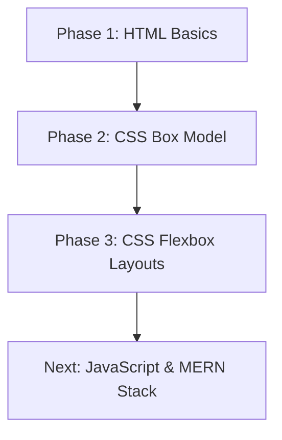

# 🎓 Web Development Learning Roadmap & Practice Lab

> **Welcome to the Web Development Learning Hub!** 🚀
> This repository is a structured, step-by-step learning guide designed for students and beginners starting their full-stack web development journey. 

If you are a student learning the fundamentals, this repository will help you master the core building blocks of the web: **HTML5** (structure) and **CSS3** (styling & layouts), laying a solid foundation before moving to JavaScript and the MERN stack.

---

## 🧑‍💻 Repository Author
* **Author:** BS Artificial Intelligence Student (6th Semester)
* **Goal:** Full-Stack MERN Developer
* **Designed for:** Beginners, self-learners, and fellow students.

---

## 🛠️ Built With & Badges


---

## 📂 Table of Contents
1. [🎓 Suggested Learning Path](#-suggested-learning-path)
2. [📁 Repository Structure & Code Walkthrough](#-repository-structure--code-walkthrough)
   - [Phase 1: HTML Basics](#phase-1-html-basics-html)
   - [Phase 2: CSS Box Model](#phase-2-css-box-model-cssbox-model)
   - [Phase 3: CSS Flexbox Layouts](#phase-3-css-flexbox-layouts-cssflex-box)
   - [Root / Starter Templates](#root--starter-templates)
3. [💡 Quick Learning Tips for Beginners](#-quick-learning-tips-for-beginners)
4. [🚀 Getting Started (How to Run Code)](#-getting-started-how-to-run-code)
5. [📈 Future Roadmap](#-future-roadmap)

---

## 🎓 Suggested Learning Path

To get the most out of this repository, we recommend following this step-by-step sequence:



1. **Step 1:** Learn how to structure text, headers, and lists in [HTML](./HTML).
2. **Step 2:** Learn how block elements behave and spacing works using the [Box Model](./CSS/Box%20Model).
3. **Step 3:** Master alignment, direction, and responsiveness using [Flexbox](./CSS/Flex%20Box).
4. **Step 4:** Build the final flexbox projects like a navbar and card grid to test your knowledge!

---

## 📁 Repository Structure & Code Walkthrough

### Phase 1: HTML Basics (`/HTML`)
These files teach you how to write semantic, accessible HTML tags. Open them to read the code, and then run them to see how the browser renders them.

* 📄 [MetaTags.html](./HTML/MetaTags.html) — **Start Here:** Learn about document setup, character encoding, and viewport settings for mobile responsiveness.
* 📄 [TextTags.html](./HTML/TextTags.html) — Headings (`<h1>` to `<h6>`), paragraph formatting, and semantic markup (`<strong>`, `<em>`).
* 📄 [Lists.html](./HTML/Lists.html) — Creating ordered lists, unordered lists, and nested lists.
* 📄 [divContainer.html](./HTML/divContainer.html) — Explains the difference between block elements (`<div>`) and inline elements (`<span>`).
* 📄 [LinksImages.html](./HTML/LinksImages.html) — Adding hyperlinks (anchor tags) and embedding images with alternative text.
* 📄 [Tables.html](./HTML/Tables.html) — Creating row/column data grids using semantic table elements.
* 📄 [Multimedia.html](./HTML/Multimedia.html) — Embedding responsive audio and video players with playback controls.
* 📄 [Forms.html](./HTML/Forms.html) — Collecting user input using text fields, emails, passwords, textareas, and submit buttons.
* 📄 [simple_page_layout.html](./HTML/simple_page_layout.html) & [practice_project.html](./HTML/practice_project.html) — Simple web structures combining all components into basic layouts.

---

### Phase 2: CSS Box Model (`/CSS/Box Model`)
Before building complex websites, you must understand how padding, margins, borders, and width/height affect elements on the page.

* 📄 [Box_model.html](./CSS/Box%20Model/Box_model.html) — **Introduction:** A visual playground displaying content, padding, border, and margin areas.
* 📄 [solution_for_margin_collapse.txt](./CSS/Box%20Model/solution_for_margin_collapse.txt) — **Crucial Concept:** A comprehensive text guide explaining margin collapse and strategies to resolve it.
* 📄 **Approaches (1 to 4):** Compare different layout alignment strategies.
  * [Approach1.html](./CSS/Box%20Model/Approach1.html) | [Approach2.html](./CSS/Box%20Model/Approach2.html) | [Approach3.html](./CSS/Box%20Model/Approach3.html) | [Approach4.html](./CSS/Box%20Model/Approach4.html)
* 📄 **Tasks (1 to 5):** Hands-on exercise challenges for styling and layout sizing.
  * [Task 1](./CSS/Box%20Model/Box_Model_Task%201.html) | [Task 2](./CSS/Box%20Model/Box_Model_Task2.html) | [Task 3](./CSS/Box%20Model/Box_Model_Task3.html) | [Task 4](./CSS/Box%20Model/Box_Model_Task4.html) | [Task 5](./CSS/Box%20Model/Box_Model_Task5.html)

---

### Phase 3: CSS Flexbox Layouts (`/CSS/Flex Box`)
Flexbox is the modern industry standard for aligning items on a webpage. Master each property individually with these dedicated playground files.

* 📄 [understand_flex.html](./CSS/Flex%20Box/understand_flex.html) — **Conceptual Base:** A quick summary of how Flexbox container-item relationships work.
* 📄 [flex_container.html](./CSS/Flex%20Box/flex_container.html) & [flex-items.html](./CSS/Flex%20Box/flex-items.html) — Initializing a flex container and basic styling.
* 📄 [flex_direction.html](./CSS/Flex%20Box/flex_direction.html) & [flex-wrap.html](./CSS/Flex%20Box/flex-wrap.html) — Aligning elements horizontally/vertically, and making them wrap onto new lines.
* 📄 [flex-flow.html](./CSS/Flex%20Box/flex-flow.html) — Shorthand syntax combining direction and wrapping.
* 📄 [justify-content.html](./CSS/Flex%20Box/justify-content.html) — Aligning items along the main axis (e.g. `center`, `space-between`, `space-around`).
* 📄 [align-items.html](./CSS/Flex%20Box/align-items.html) & [align-content.html](./CSS/Flex%20Box/align-content.html) — Aligning items along the cross axis.
* 📄 [flex-grow.html](./CSS/Flex%20Box/flex-grow.html) & [flex-shrink.html](./CSS/Flex%20Box/flex-shrink.html) — Defining how flex items grow to fill spaces or shrink to avoid overflowing.
* 📄 [align-self.html](./CSS/Flex%20Box/align-self.html) — Overriding layout alignments for individual elements.
* 📄 [gap.html](./CSS/Flex%20Box/gap.html) — The modern `gap` property to add spacing between columns/rows cleanly.

#### 🏗️ Real-World Flexbox Projects
Once you understand the properties above, practice building these components:
* 📄 [Navbar_task.html](./CSS/Flex%20Box/Navbar_task.html) — A clean, space-distributed navigation header.
* 📄 [card_grid_task2.html](./CSS/Flex%20Box/card_grid_task2.html) — A responsive grid of display cards.
* 📄 [Task3.html](./CSS/Flex%20Box/Task3.html) — Flexbox item layout challenges.
* 📄 [Full_page_layout.html](./CSS/Flex%20Box/Full_page_layout.html) — **Final Project:** A complete, beautifully styled multi-section webpage layout.

---

### Root / Starter Templates
* 📄 [simple_web_page.html](./simple_web_page.html) — A clean, fully semantic starter HTML template. Use this to kick off your own practice projects!

---

## 💡 Quick Learning Tips for Beginners

1. **Inspect Elements:** Press `F12` (or Right-click -> *Inspect*) in your web browser. Check the margins (orange highlight), padding (green highlight), and flex structures to see exactly how CSS properties affect layout positioning.
2. **Build and Break:** Don't just read the code! Open the files, change the values (e.g., change `justify-content: center` to `space-between`), save, and see how the page changes.
3. **Use Semantic HTML:** Always use descriptive tags like `<header>`, `<main>`, `<article>`, and `<footer>` instead of wrapping everything in `<div>`s. It helps browsers, search engines, and screen-readers read your site.

---

## 🚀 Getting Started (How to Run Code)

### Option 1: Preview on GitHub (Fastest)
Since this repository uses relative file paths, you can click on any `.html` file inside this repository to view its source code directly on GitHub.

### Option 2: Run Locally (Recommended)
1. **Clone the Repo:**
   ```bash
   git clone https://github.com/SaqibShah-dev/web-dev-journey.git
   ```
2. **Open in VS Code:** Open the cloned folder in VS Code.
3. **Install Live Server:** Search for and install the **Live Server** extension by Ritwick Dey in VS Code.
4. **Run a File:** Open any HTML file, click the **"Go Live"** button in the bottom right corner of VS Code, and watch the page load automatically in your web browser with hot-reload enabled!

---

## 📈 Future Roadmap
- [x] HTML5 Semantics & Multimedia Elements
- [x] CSS3 Box Model Basics
- [x] CSS Flexbox Layouts
- [ ] CSS Grid Systems
- [ ] Responsive Layouts & Media Queries
- [ ] Core JavaScript (DOM, Events, APIs)
- [ ] MERN Stack Integration (MongoDB, Express, React, Node.js)

---
*If you find this repository helpful, feel free to ⭐ star it on GitHub to keep track of updates! Happy coding! 🚀*

 
