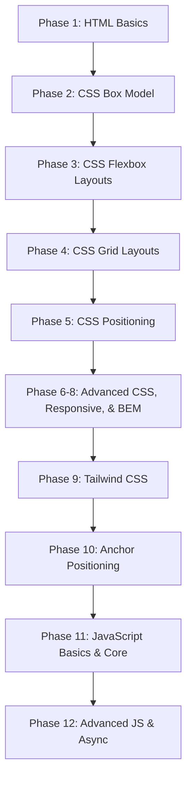

#  Web Development Learning Roadmap & Practice Lab

> **Welcome to your ultimate web development learning journey!**
> This repository is a comprehensive, hands-on learning lab designed to guide beginners, students, and self-learners through building modern, interactive, and responsive web applications. If I can learn it, so can you!

This repository tracks my personal learning progress from the absolute basics of webpage structures using **HTML5**, advanced styling and layouts with **CSS3**, modern layouts using **Flexbox and CSS Grid**, up to programming logic, DOM manipulation, and asynchronous programming in **JavaScript**.

---

##  Repository Author

* **Author:** Saqib Shah
* **Education:** BS Artificial Intelligence (Undergraduate)
* **Institution:** BIIT (Barani Institute of Information Technology)
* **University:** PMAS Arid Agriculture University (PMAS AAUR)
* **Location:** Pakistan 🇵🇰
* **Goal:** Master full-stack web development and support other learners on the same path.
* **Designed for:** Beginners, self-learners, and fellow students.

---

##  Built With & Badges


---

##  Suggested Learning Path

To get the most out of this repository, we recommend following this step-by-step sequence:



1. **Step 1: Structure** — Learn how to structure text, headers, links, images, tables, and forms in [HTML](./HTML).
2. **Step 2: Sizing & Margins** — Master padding, margins, borders, and spacing with the [Box Model](./CSS/Box%20Model).
3. **Step 3: Alignments** — Practice alignment, direction, and responsiveness using [Flexbox](./CSS/Flex%20Box).
4. **Step 4: Grid Layouts** — Build advanced 2D layouts using [CSS Grid](./CSS/grid).
5. **Step 5: Control** — Position elements precisely with [CSS Positioning](./CSS/Positioning%20Types).
6. **Step 6: Transitions & variables** — Styling states, fluid layouts, variables, and BEM architecture.
7. **Step 7: Utility CSS** — Stylize components rapidly using [Tailwind CSS](./CSS/Tailwind%20css).
8. **Step 8: Popups & tooltips** — Master CSS [Anchor Positioning](./CSS/Anchor-Positioning).
9. **Step 9: Programming Logic** — Dive into variables, functions, arrays, objects, and DOM logic in [JavaScript](./JS).

---

##  Repository Directory Tree

Here is a visual map of the workspace structure:

```bash
Learning/
├── HTML/                  # Phase 1: HTML Basics
│   ├── MetaTags.html
│   ├── TextTags.html
│   ├── Lists.html
│   ├── divContainer.html
│   ├── LinksImages.html
│   ├── Tables.html
│   ├── Multimedia.html
│   ├── Forms.html
│   ├── simple_page_layout.html
│   └── practice_project.html
├── CSS/                   # Phases 2-10: Advanced Styling & Layouts
│   ├── Box Model/         # Sizing & spacing (Tasks 1-5, collapses)
│   ├── Flex Box/          # 1D layouts (Playgrounds, navbar, cards)
│   ├── grid/              # 2D layouts (repeat, minmax, image gallery)
│   ├── Positioning Types/ # Static, relative, absolute, fixed, sticky
│   ├── CSS-Variables.../  # Themes, hover/active states, and transitions
│   ├── Responsive design/ # Mobile-first media queries, fluid typography
│   ├── css-architecture/  # Scalable CSS patterns, BEM naming
│   ├── Tailwind css/      # Utility-first rapid CSS styling
│   ├── Anchor-Positioning/# Chrome-advanced modern tooltips
│   ├── Floating_label/    # Interactive floating input styling
│   └── Netflix Landing.../# Capstone responsive clones
└── JS/                    # Phases 11-12: Core & Asynchronous JavaScript
    ├── variable-and-types/# let/const, types, memory allocation
    ├── functions/         # Declarations, expressions, arrows, call/apply/bind, closures
    ├── arrays/            # Loops, maps, filters, reduces, destructurings
    ├── Objects/           # Keys/values/entries, references, this bindings
    ├── DOM-Manipulation/  # Event listeners, class toggling, DOM updates
    └── AsyncJS/           # Callbacks, promises, async/await fetching
```

---

##  Table of Contents

1. [Quick Start (5 Minutes)](#-quick-start-5-minutes)
2. [Phase 1: HTML Basics](#-phase-1-html-basics-html)
3. [Phase 2-8: Core CSS & Styling Layouts](#-phase-2-8-core-css--styling-layouts)
4. [Phase 9: Tailwind CSS](#-phase-9-tailwind-css)
5. [Phase 10: CSS Anchor Positioning](#-phase-10-css-anchor-positioning)
6. [Phase 11: JavaScript Basics & Core OOP](#-phase-11-javascript-basics--core-oop)
7. [Phase 12: DOM Manipulation & Asynchronous JS](#-phase-12-dom-manipulation--asynchronous-js)
8. [ Showcase: Netflix Landing Page Clone](#-showcase-netflix-landing-page-clone)
9. [ Repository Statistics](#-repository-statistics)
10. [ Learning Progress & Achievements](#-learning-progress--achievements)
11. [ Prerequisites & Requirements](#-prerequisites--requirements)
12. [ Quick Learning Tips](#-quick-learning-tips)
13. [ Frequently Asked Questions (FAQ)](#-frequently-asked-questions-faq)
14. [ Contributing](#-contributing)
15. [ License](#-license)

---

## ⚡ Quick Start (5 Minutes)

**1️⃣ Clone & Navigate:**
```bash
git clone https://github.com/SaqibShah-dev/web-dev-journey.git
cd web-dev-journey
```

**2️⃣ Run with Live Server:**
- Open the directory in **VS Code** (`code .`).
- Install the **Live Server** extension (by Ritwick Dey).
- Open any `.html` file, right-click, and select **"Open with Live Server"**.
- Your browser opens automatically and hot-reloads every time you save changes!

---

##  Phase 1: HTML Basics ([/HTML](./HTML))

This directory teaches you how to write semantic, accessible HTML tags. Open the source code to read annotations, and run them to see browser rendering.

*  **[MetaTags.html](./HTML/MetaTags.html)** — Page configurations, encoding, and mobile responsive viewports.
*  **[TextTags.html](./HTML/TextTags.html)** — Headings, formatting, and semantic emphasis markup.
*  **[Lists.html](./HTML/Lists.html)** — Ordered, unordered, and nested structured list menus.
*  **[divContainer.html](./HTML/divContainer.html)** — Understanding inline (`<span>`) vs block-level (`<div>`) layouts.
* 🔗 **[LinksImages.html](./HTML/LinksImages.html)** — Adding hyperlinks and responsive images with descriptive alt text.
*  **[Tables.html](./HTML/Tables.html)** — Semantic tables with headers, body, and tabular structures.
*  **[Multimedia.html](./HTML/Multimedia.html)** — Embedding audio & video players with controls.
*  **[Forms.html](./HTML/Forms.html)** — Textareas, submit elements, password boxes, and forms.
*  **[simple_page_layout.html](./HTML/simple_page_layout.html)** & **[practice_project.html](./HTML/practice_project.html)** — Assembled pages combining semantic layout components.

---

##  Phase 2-8: Core CSS & Styling Layouts ([/CSS](./CSS))

Discover CSS box properties, styling systems, animations, layout mechanisms, and modern responsive structures.

###  Phase 2: Box Model (`/CSS/Box Model`)
Understanding borders, padding, margins, and spacing calculation.
*  **[Box_model.html](./CSS/Box%20Model/Box_model.html)** — An interactive visualization of element sizing.
*  **[solution_for_margin_collapse.txt](./CSS/Box%20Model/solution_for_margin_collapse.txt)** — A guide on how margin collapsibility works and how to bypass it.
*  **[Approaches 1-4](./CSS/Box%20Model/)** — Alignments compared: margins, table layouts, inline blocks.
*  **[Tasks 1-5](./CSS/Box%20Model/)** — Practicing specific spacing mockups.

### ↔ Phase 3: Flexbox (`/CSS/Flex Box`)
Align elements dynamically on a single axis (rows or columns).
*  **[understand_flex.html](./CSS/Flex%20Box/understand_flex.html)** — Basic concepts of parent flex containers and children items.
*  **[Playgrounds](./CSS/Flex%20Box/)** — Visual tests on properties: `justify-content`, `align-items`, `flex-wrap`, `flex-grow`, `flex-shrink`, and `gap`.
*  **[card_grid_task2.html](./CSS/Flex%20Box/card_grid_task2.html)** & **[Navbar_task.html](./CSS/Flex%20Box/Navbar_task.html)** — Aligning navbar links and product grids.
*  **[Full_page_layout.html](./CSS/Flex%20Box/Full_page_layout.html)** — A complete multi-section layout utilizing CSS Flexbox.

###  Phase 4: CSS Grid (`/CSS/grid`)
A powerful two-dimensional grid layouts system.
*  **[css_grid_fundamental.html](./CSS/grid/css_grid_fundamental.html)** — Grid templates, gaps, rows, and columns.
*  **[grid_sizing.html](./CSS/grid/grid_sizing.html)** — Pixel, percentage, content `auto`, and flexible `fr` units.
*  **[repeat.html](./CSS/grid/repeat.html)** & **[auto-fit-and-auto-fill.html](./CSS/grid/auto-fit-and-auto-fill.html)** — Clean, media-query-free responsiveness.
*  **[image-gallery-prject.html](./CSS/grid/image-gallery-prject.html)** — A masonry-style gallery featuring click-to-enlarge overlays and `grid-auto-flow: dense`.

###  Phase 5: Positioning (`/CSS/Positioning Types`)
Controlling the layout flow of elements within the document scope.
*  **[css-position-property-explain.txt](./CSS/Positioning%20Types/css-position-property-explain.txt)** — Concepts of positioning types.
*  **[Playgrounds](./CSS/Positioning%20Types/)** — Demos of `static`, `relative`, `absolute`, `fixed`, and `sticky` styling.
*  **[Task1—Badge-on-Icon.html](./CSS/Positioning%20Types/Task1—Badge-on-Icon.html)** & **[Modal.html](./CSS/Positioning%20Types/Modal.html)** — Absolute elements and overlay panels.

###  Phase 6-8: Variables, Responsive Design, and BEM Architecture
*  **[CSS-Variables](./CSS/CSS-Variables+Transitions+Pseudo-classes/CSS-variables.html)**, **[Pseudo-classes](./CSS/CSS-Variables+Transitions+Pseudo-classes/Pseudo-classes.html)**, & **[Transitions](./CSS/CSS-Variables+Transitions+Pseudo-classes/Transition-property.html)** — Consistent themes, active hover states, and smooth ease animations.
*  **[Responsive design/](./CSS/Responsive%20design)** — Mobile-first viewport setups, fluid media queries, and responsive profile cards.
*  **[css-architecture/](./CSS/css-architecture)** — Scalable CSS structures using Component-based CSS, Scoping, and BEM (Block Element Modifier) class name conventions.

---

##  Phase 9: Tailwind CSS ([/CSS/Tailwind css](./CSS/Tailwind%20css))

Accelerate styling using utility classes without writing standard style sheets.

 **[Learning-Tailwind-css.txt](./CSS/Tailwind%20css/Learning-Tailwind-css.txt)** — Setup pipelines, installation commands, and design rules.
 **[Using-Tailwind-CSS.html](./CSS/Tailwind%20css/Using-Tailwind-CSS.html)** — Standard styling replaced by rapid layouts in HTML tags.
**[Responsive-Design-in-Tailwind.html](./CSS/Tailwind%20css/Responsive-Design-in-Tailwind.html)** — Creating mobile layouts utilizing `sm:`, `md:`, `lg:` prefixes.
 **[Project.html](./CSS/Tailwind%20css/Project.html)** — A comprehensive mockup landing page styled entirely in Tailwind.

---

##  Phase 10: CSS Anchor Positioning ([/CSS/Anchor-Positioning](./CSS/Anchor-Positioning))

An exploration of the next-generation web API for tooltips and contextual overlays.

 **[Anchor-positioning-template.html](./CSS/Anchor-Positioning/Anchor-positioning-template.html)** — Positioning contextual content relative to targets using `anchor-name`, `position-anchor`, `position-area: top`, and fallback flip alignments.

---

##  Phase 11: JavaScript Basics & Core OOP ([/JS](./JS))

Transitioning into browser logic, calculations, syntax, functions, and standard data structures. Open the console panel in DevTools to view logged outputs.

###  Variables & Types (`/JS/variable-and-types`)
* **[variable-and-types.js](./JS/variable-and-types/variable-and-types.js)** — Deep dive into variable allocation:
  - Scope differences: `let` vs `const` vs `var`.
  - Memory types: Primitive values vs Reference allocations.
  - Conversions: Type coercion and comparison rules (`==` vs `===`).
  - Checking types with `typeof`.

###  Functions (`/JS/functions`)
* **[function.js](./JS/functions/function.js)** — Learning parameters, scoping, and binding:
  - Function Declarations vs anonymous Expressions vs compact Arrow functions.
  - Lexical closures and encapsulating private variables.
  - Context binding: Using `call()`, `apply()`, and `bind()` to lock `this`.
  - Hoisting mechanisms and the Temporal Dead Zone (TDZ).
  - Advanced HOFs (map, filter, reduce) and IIFEs.

###  Arrays (`/JS/arrays`)
* **[arrays.js](./JS/arrays/arrays.js)** — List processing and algorithms:
  - Transformations and searches: `map()`, `filter()`, `reduce()`, `find()`, and `sort()`.
  - Array extensions: Spread operators, rest arguments, and destructuring syntax.
  - Iterating layouts: `forEach()`, `some()`, `every()`, and multi-dimensional matrices.

###  Objects (`/JS/Objects`)
* **[objects.js](./JS/Objects/objects.js)** — Mapping labels and custom objects:
  - Structuring key-value pairs, adding/deleting properties, and nesting objects.
  - Access methods: Dot notation vs dynamic brackets (`[]`).
  - Property utilities: `Object.keys()`, `Object.values()`, and `Object.entries()`.
  - Object destructuring, default values, and optional chaining (`?.`).
  - Context scopes: Arrow function context inheritance vs traditional method `this` calls.

---

##  Phase 12: DOM Manipulation & Asynchronous JS ([/JS](./JS))

Interacting with user events, styling document trees, and fetching remote data.

###  DOM Manipulation (`/JS/DOM-Manipulation`)
* **[dom-manipulation.js](./JS/DOM-Manipulation/dom-manipulation.js)** — Selecting HTML elements, adding dynamic click/focus events, injecting contents, and mutating styling classes in real-time.
* **[exercise.js](./JS/DOM-Manipulation/exercise.js)** — Practical logic challenges for DOM modifications.

###  Asynchronous JavaScript (`/JS/AsyncJS`)
* **[Async.js](./JS/AsyncJS/Async.js)** — Handling time-delayed tasks:
  - Execution thread flow: Single-threaded sync actions vs async event loops.
  - Legacy models: Callback flows, resolving nested callback hells.
  - Modern promises: Creating resolved/rejected promises and chaining `.then()` / `.catch()`.
  - Async/Await: Modern sequential syntax for async flow and `try-catch` error controls.
  - API Fetching: Loading remote API resources asynchronously.
* **[exerciseTask.js](./JS/AsyncJS/exerciseTask.js)** — Exercises verifying async promise chains.

---

##  Showcase: Netflix Landing Page Clone

The crowning project of the CSS track, combining all semantic structures and modern styling techniques.

* 📍 **Files:** **[Netflix-Landing-page.html](./CSS/Netflix%20Landing%20Page/Netflix-Landing-page.html)** & **[style.css](./CSS/Netflix%20Landing%20Page/style.css)**
* **Highlights:**
  - Responsive banner layout with grid cards (1-10 carousel design).
  - Floating labels, glowing section breaks, FAQ accordion panel wrappers (`<details>`).
  - Pure HTML & CSS layout with zero dependencies.
  - Accessible language selector dropdown structure.

---

##  Repository Statistics

| Track | Learning Modules | Lab Files | Completed Tasks |
|:---|:---:|:---:|:---:|
| **HTML Fundamentals** | 8 | 10 HTML templates | 2 Full pages |
| **CSS Core Layouts** | 10 | 50+ Stylesheets & pages | 15 Layout tasks |
| **Tailwind & Modern CSS** | 3 | 5 Configurations & pages | 2 Landing projects |
| **JavaScript Core Logic** | 6 | 12 Code scripts & loaders | 10 Interactive tasks |

---

##  Learning Progress & Achievements

###  Completed Milestones
- **[x] Phase 1:** HTML5 Semantic Document Structuring.
- **[x] Phase 2-5:** CSS Box Model, Flexbox, Grid Layouts, and Positioning systems.
- **[x] Phase 6-8:** Responsive layout techniques, BEM conventions, variables, and transitions.
- **[x] Phase 9-10:** Utility Tailwind CSS integration and modern Anchor Position APIs.
- **[x] Phase 11:** JavaScript variables, types, memory allocation, bindings, functions, and closures.
- **[x] Phase 12:** Event listeners, DOM manipulations, promises, async/await, and API fetching.

###  Coming Up Next
- **[ ] Phase 13:** Git & Github team workflows.
- **[ ] Phase 14:** React.js framework and state variables.
- **[ ] Phase 15:** Full Stack MERN Development (Node.js, Express, MongoDB).

---

##  Prerequisites & Requirements

- ✅ A **modern web browser** (Chrome, Firefox, or Edge).
- ✅ **VS Code** with the **Live Server** extension.
- ✅ **Git** installed for version control.
- ✅ Basic knowledge of computer file navigation.
- No prior coding experience required — this repository starts from the absolute basics!

---

##  Quick Learning Tips

1. **Open Browser DevTools (`F12`):** Go to the **Console** tab to view JavaScript outputs, and use the **Elements** tab to inspect CSS properties.
2. **Build and Break:** Don't hesitate to edit values, change background colors, or modify variable declarations in the templates to see what happens.
3. **Compare Solutions:** In CSS Box Model, compare files `Approach1.html` to `Approach4.html` side-by-side to understand different layout techniques.
4. **Follow inline annotations:** Every lab file contains detailed comments explaining the exact syntax and purpose of each property/function.

---

##  Frequently Asked Questions (FAQ)

**Q: Do I need to learn HTML before CSS?**  
A: Start with Phase 1 HTML to understand tags. Once you can make a form and a text block, learn CSS to style them.

**Q: What is the difference between Flexbox and Grid?**  
A: **Flexbox** handles layout on a single dimension (such as a row of navbar links). **Grid** handles two-dimensional placements (such as rows and columns on a homepage structure).

**Q: Why do my JS console scripts show blank pages?**  
A: Many JS files (like `variable-and-types.js` or `function.js`) write outputs to the browser console. Open `index.html` in that folder, press `F12`, and check the **Console** tab.

**Q: Can I use this code for my own templates?**  
A: Absolutely! The starter file **`simple_web_page.html`** in the root is specifically designed as a boilerplate for your new projects.

---

##  Contributing

Contributions are always welcome! If you notice a typo, have a better way to explain a coding concept, or want to submit extra practice tasks:

1. **Fork** this repository.
2. Create your branch: `git checkout -b feature/contribution`
3. Commit improvements: `git commit -m "docs: improve variable annotations"`
4. Push to branch: `git push origin feature/contribution`
5. Open a **Pull Request**.

---

