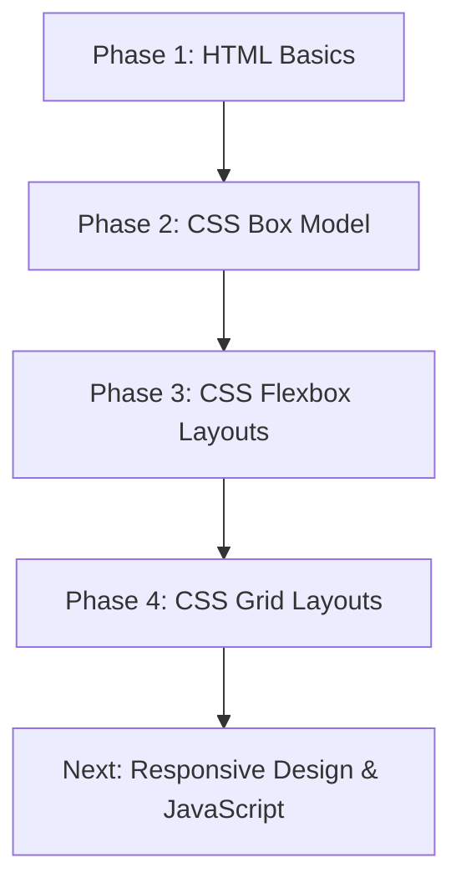

#  Web Development Learning Roadmap & Practice Lab

> **Welcome to the Web Development Learning Hub!** 
> This repository is a structured, step-by-step learning guide designed for students and beginners starting their full-stack web development journey. 

If you are a student learning the fundamentals, this repository will help you master the core building blocks of the web: **HTML5** (structure) and **CSS3** (styling & layouts), laying a solid foundation before moving to JavaScript and the MERN stack.

---

##  Repository Author
* **Author:** Saqib Shah
* **Education:** BS Artificial Intelligence (Undergraduate)
* **Institution:** BIIT (Barani Institute of Information Technology)
* **University:** PMAS Arid Agriculture University (PMAS AAUR)
* **Location:** Pakistan 🇵🇰
* **Goal:** Full-Stack Web Developer Developer & Tech Innovation
* **Designed for:** Beginners, self-learners, and fellow students.

---

##  Built With & Badges


---

##  Table of Contents
1. [ Suggested Learning Path](#-suggested-learning-path)
2. [ Repository Structure & Code Walkthrough](#-repository-structure--code-walkthrough)
   - [Phase 1: HTML Basics](#phase-1-html-basics-html)
   - [Phase 2: CSS Box Model](#phase-2-css-box-model-cssbox-model)
   - [Phase 3: CSS Flexbox Layouts](#phase-3-css-flexbox-layouts-cssflex-box)
   - [Phase 4: CSS Grid Layouts](#phase-4-css-grid-layouts-cssgrid)
   - [Root / Starter Templates](#root--starter-templates)
3. [ Prerequisites & Requirements](#-prerequisites--requirements)
4. [ Quick Learning Tips for Beginners](#-quick-learning-tips-for-beginners)
5. [ Learning Challenges & Self-Assessment](#-learning-challenges--self-assessment)
6. [ Frequently Asked Questions (FAQ)](#-frequently-asked-questions-faq)
7. [ Helpful External Resources](#-helpful-external-resources)
8. [ Contributing](#-contributing)
9. [ Getting Started (How to Run Code)](#-getting-started-how-to-run-code)
10. [ Future Roadmap](#-future-roadmap)
11. [ License](#-license)
12. [ Support & Feedback](#-support--feedback)

---

##  Suggested Learning Path

To get the most out of this repository, we recommend following this step-by-step sequence:



1. **Step 1:** Learn how to structure text, headers, and lists in [HTML](./HTML).
2. **Step 2:** Learn how block elements behave and spacing works using the [Box Model](./CSS/Box%20Model).
3. **Step 3:** Master alignment, direction, and responsiveness using [Flexbox](./CSS/Flex%20Box).
4. **Step 4:** Build advanced 2D layouts using [CSS Grid](./CSS/grid).
5. **Step 5:** Build final projects combining CSS and HTML knowledge!

---

##  Repository Structure & Code Walkthrough

### Phase 1: HTML Basics (`/HTML`)
These files teach you how to write semantic, accessible HTML tags. Open them to read the code, and then run them to see how the browser renders them.

*  [MetaTags.html](./HTML/MetaTags.html) — **Start Here:** Learn about document setup, character encoding, and viewport settings for mobile responsiveness.
*  [TextTags.html](./HTML/TextTags.html) — Headings (`<h1>` to `<h6>`), paragraph formatting, and semantic markup (`<strong>`, `<em>`).
*  [Lists.html](./HTML/Lists.html) — Creating ordered lists, unordered lists, and nested lists.
*  [divContainer.html](./HTML/divContainer.html) — Explains the difference between block elements (`<div>`) and inline elements (`<span>`).
*  [LinksImages.html](./HTML/LinksImages.html) — Adding hyperlinks (anchor tags) and embedding images with alternative text.
*  [Tables.html](./HTML/Tables.html) — Creating row/column data grids using semantic table elements.
*  [Multimedia.html](./HTML/Multimedia.html) — Embedding responsive audio and video players with playback controls.
*  [Forms.html](./HTML/Forms.html) — Collecting user input using text fields, emails, passwords, textareas, and submit buttons.
*  [simple_page_layout.html](./HTML/simple_page_layout.html) & [practice_project.html](./HTML/practice_project.html) — Simple web structures combining all components into basic layouts.

---

### Phase 2: CSS Box Model (`/CSS/Box Model`)
Before building complex websites, you must understand how padding, margins, borders, and width/height affect elements on the page.

*  [Box_model.html](./CSS/Box%20Model/Box_model.html) — **Introduction:** A visual playground displaying content, padding, border, and margin areas.
*  [solution_for_margin_collapse.txt](./CSS/Box%20Model/solution_for_margin_collapse.txt) — **Crucial Concept:** A comprehensive text guide explaining margin collapse and strategies to resolve it.
*  **Approaches (1 to 4):** Compare different layout alignment strategies.
  * [Approach1.html](./CSS/Box%20Model/Approach1.html) | [Approach2.html](./CSS/Box%20Model/Approach2.html) | [Approach3.html](./CSS/Box%20Model/Approach3.html) | [Approach4.html](./CSS/Box%20Model/Approach4.html)
*  **Tasks (1 to 5):** Hands-on exercise challenges for styling and layout sizing.
  * [Task 1](./CSS/Box%20Model/Box_Model_Task%201.html) | [Task 2](./CSS/Box%20Model/Box_Model_Task2.html) | [Task 3](./CSS/Box%20Model/Box_Model_Task3.html) | [Task 4](./CSS/Box%20Model/Box_Model_Task4.html) | [Task 5](./CSS/Box%20Model/Box_Model_Task5.html)

---

### Phase 3: CSS Flexbox Layouts (`/CSS/Flex Box`)
Flexbox is the modern industry standard for aligning items on a webpage. Master each property individually with these dedicated playground files.

*  [understand_flex.html](./CSS/Flex%20Box/understand_flex.html) — **Conceptual Base:** A quick summary of how Flexbox container-item relationships work.
*  [flex_container.html](./CSS/Flex%20Box/flex_container.html) & [flex-items.html](./CSS/Flex%20Box/flex-items.html) — Initializing a flex container and basic styling.
*  [flex_direction.html](./CSS/Flex%20Box/flex_direction.html) & [flex-wrap.html](./CSS/Flex%20Box/flex-wrap.html) — Aligning elements horizontally/vertically, and making them wrap onto new lines.
*  [flex-flow.html](./CSS/Flex%20Box/flex-flow.html) — Shorthand syntax combining direction and wrapping.
*  [justify-content.html](./CSS/Flex%20Box/justify-content.html) — Aligning items along the main axis (e.g. `center`, `space-between`, `space-around`).
*  [align-items.html](./CSS/Flex%20Box/align-items.html) & [align-content.html](./CSS/Flex%20Box/align-content.html) — Aligning items along the cross axis.
*  [flex-grow.html](./CSS/Flex%20Box/flex-grow.html) & [flex-shrink.html](./CSS/Flex%20Box/flex-shrink.html) — Defining how flex items grow to fill spaces or shrink to avoid overflowing.
*  [align-self.html](./CSS/Flex%20Box/align-self.html) — Overriding layout alignments for individual elements.
*  [gap.html](./CSS/Flex%20Box/gap.html) — The modern `gap` property to add spacing between columns/rows cleanly.

####  Real-World Flexbox Projects
Once you understand the properties above, practice building these components:
*  [Navbar_task.html](./CSS/Flex%20Box/Navbar_task.html) — A clean, space-distributed navigation header.
*  [card_grid_task2.html](./CSS/Flex%20Box/card_grid_task2.html) — A responsive grid of display cards.
*  [Task3.html](./CSS/Flex%20Box/Task3.html) — Flexbox item layout challenges.
*  [Full_page_layout.html](./CSS/Flex%20Box/Full_page_layout.html) — **Final Project:** A complete, beautifully styled multi-section webpage layout.

---

### Phase 4: CSS Grid Layouts (`/CSS/grid`)
**CSS Grid is a 2D layout system** that lets you create complex, multi-row and multi-column layouts. While Flexbox is best for one-dimensional layouts (rows OR columns), Grid handles both dimensions simultaneously. Perfect for dashboard layouts, magazine grids, and component-based designs!

#### Why Learn CSS Grid?
✅ **2D Control:** Control both rows AND columns at the same time  
✅ **Precise Positioning:** Place items exactly where you want them  
✅ **Responsive:** Build layouts that scale beautifully with `fr` units and `auto`  
✅ **Industry Standard:** Used in modern web design for complex UI layouts

#### Core Grid Concepts

**1. Understanding Grid Basics**
*  [css_grid_fundamental.html](./CSS/grid/css_grid_fundamental.html) — **Start Here:** Learn the fundamental grid structure with `grid-template-columns`, `grid-template-rows`, and `grid-gap`.

**2. Sizing Grid Tracks (Columns & Rows)**
*  [sizing-tracks-FINISHED.html](./CSS/grid/sizing-tracks-FINISHED.html) — Learn to size columns using:
   - `px` (fixed pixels)
   - `%` (percentage)
   - `auto` (content-based sizing)
   - **`1fr` (fractional units — splits available space equally)**
   
   Example: `grid-template-columns: 1fr 50px 1fr 1fr;` creates responsive columns!

**3. Using the `repeat()` Function**
*  [repeat.html](./CSS/grid/repeat.html) — Avoid repetitive code with `repeat()`:
   - `repeat(3, 100px)` = `100px 100px 100px`
   - `repeat(2, 1fr auto)` = `1fr auto 1fr auto`
   
   This makes your CSS cleaner and more maintainable!

**4. Grid Template & Named Lines**
*  [grid-template.html](./CSS/grid/grid-template.html) — Master advanced grid features:
   - Named grid lines: `[first] 40px [line2] 50px`
   - Grid template areas for semantic layouts
   - Combining fixed and flexible sizing

**5. Sizing Individual Grid Items**
*  [sizing-items.html](./CSS/grid/sizing-items.html) — Learn how to make items span multiple tracks:
   - `grid-column: span 3;` — item stretches across 3 columns
   - `grid-row: span 2;` — item stretches across 2 rows
   - `grid-column: 1 / 4;` — explicit positioning (line 1 to line 4)

**6. Placing Items on the Grid**
*  [placing.html](./CSS/grid/placing.html) — Position items using grid lines:
   - Place items in specific grid cells
   - Create overlapping layouts
   - Combine sizing and positioning

**7. Automatic Grid Flow**
*  [autoflow-START.html](./CSS/grid/autoflow-START.html) & [autoflow-FINISHED.html](./CSS/grid/autoflow-FINISHED.html) — Understand how items automatically fill the grid:
   - `grid-auto-flow: row` (default — fills left to right)
   - `grid-auto-flow: column` (fills top to bottom)

**8. Implicit vs. Explicit Grids**
*  [implicit-vs-explicit.html](./CSS/grid/implicit-vs-explicit.html) — Learn the difference:
   - **Explicit Grid:** Columns/rows YOU define
   - **Implicit Grid:** Extra columns/rows created automatically

**9. `auto-fit` vs `auto-fill`**
*  [auto-fit-and-auto-fill.html](./CSS/grid/auto-fit-and-auto-fill.html) — Create responsive grids WITHOUT media queries:
   - `repeat(auto-fit, minmax(200px, 1fr))` — columns shrink/grow dynamically
   - Perfect for mobile-first responsive layouts!

**10. Developer Tools for Grid**
*  [dev-tools-START.html](./CSS/grid/dev-tools-START.html) & [dev-tools-FINISHED.html](./CSS/grid/dev-tools-FINISHED.html) — Learn to inspect and debug CSS Grid using browser DevTools:
   - Visualize grid lines in Firefox Developer Tools
   - Inspect grid container and item properties
   - Debug layout issues faster

#### Key CSS Grid Properties Reference

| Property | Purpose | Example |
|----------|---------|---------|
| `display: grid;` | Initialize grid container | — |
| `grid-template-columns` | Define column widths | `200px 1fr 100px` |
| `grid-template-rows` | Define row heights | `100px auto 50px` |
| `grid-gap` | Space between items | `20px` or `20px 10px` |
| `grid-column: span X` | Item spans X columns | `span 2` |
| `grid-row: span X` | Item spans X rows | `span 3` |
| `grid-template-areas` | Create named layout zones | `"header header"` |
| `repeat(X, size)` | Repeat columns/rows | `repeat(3, 1fr)` |
| `1fr` | Fractional unit | Divides space equally |
| `minmax(min, max)` | Set min and max sizes | `minmax(200px, 1fr)` |
| `auto-fit` / `auto-fill` | Responsive columns | `repeat(auto-fit, ...)` |

#### Quick Tip: When to Use Grid vs. Flexbox?
- **Use Flexbox:** Navbars, button groups, card layouts (1D)
- **Use Grid:** Page layouts, dashboards, image galleries (2D)
- **Use Both:** Grid for layout, Flexbox for alignment within grid items!

---

### Root / Starter Templates
*  [simple_web_page.html](./simple_web_page.html) — A clean, fully semantic starter HTML template. Use this to kick off your own practice projects!

---

##  Prerequisites & Requirements

Before starting, make sure you have:
- ✅ A **modern web browser** (Chrome, Firefox, Safari, or Edge)
- ✅ **VS Code** installed ([Download here](https://code.visualstudio.com/))
- ✅ **Git** installed for version control ([Download here](https://git-scm.com/))
- ✅ **Live Server Extension** for VS Code (for hot-reload)
- ✅ Basic computer literacy (opening files, editing text, saving documents)

**No prior coding experience required!** This repository starts from absolute basics.

---

##  Quick Learning Tips for Beginners

| 💡 Tip | How to Use It |
|--------|---------------|
| **Inspect Elements** | Press `F12` → open DevTools → hover over elements to see CSS properties in real-time |
| **Build and Break** | Change CSS values deliberately to see immediate effects (e.g., `width: 100px` → `width: 500px`) |
| **Use Semantic HTML** | Use `<header>`, `<main>`, `<section>`, `<footer>` instead of generic `<div>`s |
| **Read Comments** | Every example file has inline comments explaining what each CSS property does |
| **Experiment Freely** | Create copies of files and modify them without worrying about breaking things |
| **Compare Files** | Open Approach1, Approach2, Approach3 side-by-side to see different solutions to the same problem |

---

##  Learning Challenges & Self-Assessment

Each phase includes **hands-on tasks** to test your knowledge:

| Phase | Challenge Files | What You'll Build |
|-------|-----------------|------------------|
| HTML | [Forms.html](./HTML/Forms.html), [Tables.html](./HTML/Tables.html) | Interactive forms, data tables |
| Box Model | [Box_Model_Task 1-5](./CSS/Box%20Model) | Centered layouts, card designs |
| Flexbox | [Navbar_task.html](./CSS/Flex%20Box/Navbar_task.html), [Full_page_layout.html](./CSS/Flex%20Box/Full_page_layout.html) | Navigation bar, complete webpage |
| Grid | [sizing-items.html](./CSS/grid/sizing-items.html), [auto-fit-and-auto-fill.html](./CSS/grid/auto-fit-and-auto-fill.html) | Responsive grids, dashboard layouts |

**Pro Tip:** Try building these tasks WITHOUT looking at the solution files first. Use DevTools to debug!

---

##  Frequently Asked Questions (FAQ)

**Q: Do I need to learn all of HTML before starting CSS?**  
A: No! You can learn HTML and CSS in parallel. Start with basic HTML tags, then dive into CSS styling.

**Q: What's the difference between Flexbox and Grid?**  
A: **Flexbox** = 1D layouts (rows OR columns). **Grid** = 2D layouts (rows AND columns together). See the [comparison table](#quick-tip-when-to-use-grid-vs-flexbox) above.

**Q: How long does it take to master these concepts?**  
A: ~2-4 weeks if you practice daily. Focus on understanding the "why" behind each property, not memorizing syntax.

**Q: Can I use this for production websites?**  
A: Yes! HTML5, CSS3, and modern layouts (Flexbox/Grid) are production-ready. However, you'll also need JavaScript for interactivity.

**Q: Should I watch tutorials or read documentation?**  
A: **Both!** Code along with tutorials, then practice by modifying these files. Hands-on experience is key.

**Q: I'm stuck on a concept. What should I do?**  
A: 1) Re-read the comments in the code, 2) Use DevTools to inspect elements, 3) Modify values and observe changes, 4) Compare with similar files.

---

---

---

##  Helpful External Resources

While this repository is comprehensive, these external resources can complement your learning:

### MDN Web Docs (Official Documentation)
- [HTML Elements Reference](https://developer.mozilla.org/en-US/docs/Web/HTML/Element)
- [CSS Reference](https://developer.mozilla.org/en-US/docs/Web/CSS)
- [Flexbox Guide](https://developer.mozilla.org/en-US/docs/Learn/CSS/CSS_layout/Flexbox)
- [Grid Guide](https://developer.mozilla.org/en-US/docs/Learn/CSS/CSS_layout/Grids)

### Interactive Learning Platforms
- [Web.dev by Google](https://web.dev/learn/css/) — Free CSS course
- [CSS Tricks](https://css-tricks.com/) — In-depth articles on CSS
- [Can I Use?](https://caniuse.com/) — Check browser compatibility

### Practice Platforms
- [CodePen](https://codepen.io/) — Share and explore code snippets
- [FreeCodeCamp](https://www.freecodecamp.org/) — Free full-stack courses

---

##  Contributing

Found a bug or want to improve this repository? Contributions are welcome!

### How to Contribute:
1. **Fork** this repository
2. **Create a branch:** `git checkout -b feature/improvement`
3. **Make changes** to files or add new examples
4. **Commit:** `git commit -m "Add/fix: description"`
5. **Push:** `git push origin feature/improvement`
6. **Open a Pull Request** with a clear description

### Contribution Ideas:
- Fix typos or improve explanations
- Add new CSS examples (animations, transitions, transforms)
- Create responsive design examples
- Add JavaScript interactivity examples
- Improve code comments

---

##  Getting Started (How to Run Code)

### Option 1: Preview on GitHub (Fastest)
Since this repository uses relative file paths, you can click on any `.html` file inside this repository to view its source code directly on GitHub.

### Option 2: Run Locally (Recommended)
1. **Clone the Repo:**
   ```bash
   git clone https://github.com/SaqibShah-dev/web-dev-journey.git
   cd "Learning"
   ```
2. **Open in VS Code:** 
   ```bash
   code .
   ```
3. **Install Live Server:** Search for and install the **Live Server** extension by Ritwick Dey in VS Code.
4. **Run a File:** Open any HTML file, right-click → **"Open with Live Server"**, and watch it load automatically in your browser with hot-reload!


##  Project Statistics

| Category | Count |
|----------|-------|
| **Total HTML Files** | 10 |
| **CSS Learning Files** | 35+ |
| **Code Examples** | 100+ |
| **Hands-on Tasks** | 15+ |

---

##  Future Roadmap

### Completed ✅
- [x] HTML5 Semantics & Multimedia Elements
- [x] CSS3 Box Model Basics
- [x] CSS Flexbox Layouts
- [x] CSS Grid Systems

### In Progress 
- [ ] Responsive Layouts & Media Queries
- [ ] CSS Animations & Transitions
- [ ] CSS Transforms & Effects

### Coming Soon 
- [ ] Core JavaScript (DOM, Events, APIs)
- [ ] Asynchronous JavaScript (Promises, Async/Await)
- [ ] MERN Stack Integration (MongoDB, Express, React, Node.js)
- [ ] Git & GitHub Workflow
- [ ] Web Performance Optimization

---

##  License


##  Support & Feedback

- **Have questions?** Open an [Issue](https://github.com/SaqibShah-dev/web-dev-journey/issues)
- **Want to suggest improvements?** Submit a [Pull Request](https://github.com/SaqibShah-dev/web-dev-journey/pulls)
- **Found this helpful?** Please ⭐ **star this repository** to show your support!

---

##  Quick Start Checklist

- [ ] Clone the repository or download the files
- [ ] Install VS Code and Live Server extension
- [ ] Start with [MetaTags.html](./HTML/MetaTags.html) in the HTML folder
- [ ] Progress through each Phase in order
- [ ] Complete the hands-on tasks at the end of each phase
- [ ] Build your own project combining all learned concepts
- [ ] ⭐ Star this repo if it helped you!

---

<div align="center">

**Made with  by a student, for students.**

*Happy Learning! Your web development journey starts here! *

</div>
