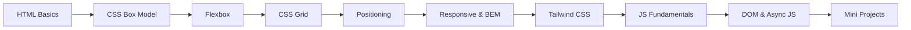

# Web Development Learning Journey

> **A hands-on practice lab for beginners — built while learning, shared so you can learn too.**

[](./HTML)
[](./CSS)
[](./JS)
[](./LICENSE)

---

## About This Repository

This repo is my **personal web development learning notebook** — every folder contains real code I wrote while studying HTML, CSS, and JavaScript. I created it for two reasons:

1. **To track my own progress** as I move from basics to more advanced topics.
2. **To help other beginners** who want a clear, step-by-step path into web development without getting lost in theory.

If I can learn it, so can you. Every file has comments, exercises, and runnable examples you can open, edit, and break — that's how you actually learn.

**No frameworks. No build tools. Just HTML, CSS, and JavaScript** — the same foundations every web developer needs.

---

## Who Is This For?

| You are... | Start here |
|:---|:---|
| **Complete beginner** — never coded before | [Quick Start](#-quick-start-5-minutes) → [Phase 1: HTML](./HTML) |
| **Know a little HTML** — want to style pages | [Phase 2: CSS Box Model](./CSS/Box%20Model) |
| **Comfortable with CSS** — ready for logic | [Phase 11: JavaScript](./JS) |
| **Self-learner** — want a structured roadmap | Follow the [Suggested Learning Path](#-suggested-learning-path) below |
| **Fellow student** — looking for practice files | Browse by topic in the [Directory Tree](#-repository-directory-tree) |

---

## What You'll Learn

| Track | Topics | Folder |
|:---|:---|:---|
| **HTML** | Semantic tags, forms, tables, media, page layouts | [`/HTML`](./HTML) |
| **CSS** | Box model, Flexbox, Grid, positioning, responsive design, BEM, Tailwind | [`/CSS`](./CSS) |
| **JavaScript** | Variables, functions, arrays, objects, DOM, async, ES6, mini projects | [`/JS`](./JS) |

Each folder has its own detailed guide:
- [HTML README](./HTML/README.md)
- [CSS README](./CSS/README.md)
- [JavaScript README](./JS/README.md)

---

## Repository Author

| | |
|:---|:---|
| **Name** | Saqib Shah |
| **Education** | BS Artificial Intelligence (Undergraduate) |
| **Institution** | BIIT — Barani Institute of Information Technology |
| **University** | PMAS Arid Agriculture University (PMAS AAUR) |
| **Location** | Pakistan |
| **Goal** | Master full-stack web development and help others on the same path |

---

## Suggested Learning Path

Follow these phases in order. Each one builds on the last.



| Step | Phase | What you practice | Folder |
|:---:|:---|:---|:---|
| 1 | Structure | Tags, forms, semantic layout | [HTML](./HTML) |
| 2 | Sizing | Padding, margins, box model | [Box Model](./CSS/Box%20Model) |
| 3 | 1D Layout | Rows, columns, navbars | [Flexbox](./CSS/Flex%20Box) |
| 4 | 2D Layout | Grids, galleries, cards | [CSS Grid](./CSS/grid) |
| 5 | Control | Absolute, fixed, sticky | [Positioning](./CSS/Positioning%20Types) |
| 6 | Polish | Variables, transitions, responsive | [CSS Advanced](./CSS) |
| 7 | Utility CSS | Rapid styling with classes | [Tailwind](./CSS/Tailwind%20css) |
| 8 | Logic | Variables, functions, arrays | [JavaScript](./JS) |
| 9 | Interactivity | DOM events, API fetching | [JS Advanced](./JS) |
| 10 | Projects | Real apps combining everything | [Mini Projects](#-mini-projects) |

---

## Repository Directory Tree

```
Learning/
├── HTML/                      # Phase 1: Page structure & semantics
│   ├── MetaTags.html
│   ├── TextTags.html
│   ├── Lists.html
│   ├── Forms.html
│   ├── simple_page_layout.html
│   └── practice_project.html
│
├── CSS/                       # Phases 2–10: Styling & layouts
│   ├── Box Model/
│   ├── Flex Box/
│   ├── grid/
│   ├── Positioning Types/
│   ├── Responsive design/
│   ├── css-architecture/      # BEM naming conventions
│   ├── Tailwind css/
│   ├── Anchor-Positioning/
│   ├── Floating_label/
│   └── Netflix Landing Page/  # CSS capstone project
│
└── JS/                        # Phases 11–12: Logic & interactivity
    ├── variable-and-types/
    ├── functions/
    ├── arrays/
    ├── Objects/
    ├── scopeAndClosure/
    ├── callstack/
    ├── EventLoop/
    ├── ES6/                   # Template literals, modules, optional chaining
    ├── DOM-Manipulation/
    ├── AsyncJS/
    ├── to-do-list/            # Mini project
    └── githubProfileSearch/   # Mini project (API + DOM)
```

---

## Table of Contents

1. [Quick Start (5 Minutes)](#-quick-start-5-minutes)
2. [Phase 1: HTML Basics](#-phase-1-html-basics)
3. [Phases 2–8: CSS Layouts & Styling](#-phases-28-css-layouts--styling)
4. [Phase 9: Tailwind CSS](#-phase-9-tailwind-css)
5. [Phase 10: CSS Anchor Positioning](#-phase-10-css-anchor-positioning)
6. [Phase 11: JavaScript Fundamentals](#-phase-11-javascript-fundamentals)
7. [Phase 12: DOM, Async & How JS Works](#-phase-12-dom-async--how-js-works)
8. [Mini Projects](#-mini-projects)
9. [Showcase: Netflix Landing Page](#-showcase-netflix-landing-page)
10. [Learning Progress](#-learning-progress)
11. [Prerequisites](#-prerequisites)
12. [Tips for Beginners](#-tips-for-beginners)
13. [FAQ](#-faq)
14. [Contributing](#-contributing)
15. [License](#-license)

---

## Quick Start (5 Minutes)

**You need:** A code editor ([VS Code](https://code.visualstudio.com/)) and a web browser (Chrome, Firefox, or Edge).

### 1. Clone the repository

```bash
git clone https://github.com/SaqibShah-dev/web-dev-journey.git
cd web-dev-journey
```

### 2. Open in VS Code

```bash
code .
```

### 3. Install Live Server

In VS Code, go to **Extensions** (`Ctrl+Shift+X`) and install **Live Server** by Ritwick Dey.

### 4. Run your first file

1. Open [`HTML/TextTags.html`](./HTML/TextTags.html)
2. Right-click inside the file → **Open with Live Server**
3. Your browser opens the page. Edit and save — the browser refreshes automatically.

### 5. For JavaScript files

Open the `index.html` inside any JS folder, run it with Live Server, then press **F12** → **Console** tab to see the output.

---

## Phase 1: HTML Basics

**Folder:** [`/HTML`](./HTML) · **Detailed guide:** [HTML README](./HTML/README.md)

Learn how to structure web pages with semantic, accessible HTML5.

| File | Topic |
|:---|:---|
| [MetaTags.html](./HTML/MetaTags.html) | Page config, encoding, mobile viewport |
| [TextTags.html](./HTML/TextTags.html) | Headings, paragraphs, emphasis |
| [Lists.html](./HTML/Lists.html) | Ordered, unordered, nested lists |
| [divContainer.html](./HTML/divContainer.html) | Block (`<div>`) vs inline (`<span>`) |
| [LinksImages.html](./HTML/LinksImages.html) | Hyperlinks and images with `alt` text |
| [Tables.html](./HTML/Tables.html) | Semantic tables with headers |
| [Multimedia.html](./HTML/Multimedia.html) | Audio and video embeds |
| [Forms.html](./HTML/Forms.html) | Inputs, textareas, labels, buttons |
| [simple_page_layout.html](./HTML/simple_page_layout.html) | Full page with `<header>`, `<nav>`, `<main>`, `<footer>` |
| [practice_project.html](./HTML/practice_project.html) | Combined practice project |

---

## Phases 2–8: CSS Layouts & Styling

**Folder:** [`/CSS`](./CSS) · **Detailed guide:** [CSS README](./CSS/README.md)

### Phase 2: Box Model

Understanding borders, padding, margins, and spacing.

- [Box_model.html](./CSS/Box%20Model/Box_model.html) — Interactive sizing visualization
- [solution_for_margin_collapse.txt](./CSS/Box%20Model/solution_for_margin_collapse.txt) — Margin collapse explained
- [Approaches 1–4](./CSS/Box%20Model/) — Different alignment techniques
- [Tasks 1–5](./CSS/Box%20Model/) — Spacing practice mockups

### Phase 3: Flexbox

One-dimensional layouts (rows or columns).

- [understand_flex.html](./CSS/Flex%20Box/understand_flex.html) — Core flex concepts
- [Playgrounds](./CSS/Flex%20Box/) — `justify-content`, `align-items`, `flex-wrap`, `gap`
- [Navbar_task.html](./CSS/Flex%20Box/Navbar_task.html) — Navigation bar layout
- [Full_page_layout.html](./CSS/Flex%20Box/Full_page_layout.html) — Multi-section page

### Phase 4: CSS Grid

Two-dimensional layouts (rows and columns together).

- [css_grid_fundamental.html](./CSS/grid/css_grid_fundamental.html) — Grid templates and gaps
- [repeat.html](./CSS/grid/repeat.html) — `repeat()` helper
- [auto-fit-and-auto-fill.html](./CSS/grid/auto-fit-and-auto-fill.html) — Responsive columns without media queries
- [image-gallery-prject.html](./CSS/grid/image-gallery-prject.html) — Masonry-style gallery

### Phase 5: Positioning

Controlling where elements sit on the page.

- [css-position-property-explain.txt](./CSS/Positioning%20Types/css-position-property-explain.txt) — Concepts guide
- [Playgrounds](./CSS/Positioning%20Types/) — `static`, `relative`, `absolute`, `fixed`, `sticky`
- [Task1—Badge-on-Icon.html](./CSS/Positioning%20Types/Task1—Badge-on-Icon.html) — Notification badge
- [Modal.html](./CSS/Positioning%20Types/Modal.html) — Overlay popup

### Phases 6–8: Variables, Responsive Design & BEM

- [CSS Variables](./CSS/CSS-Variables+Transitions+Pseudo-classes/CSS-variables.html), [Pseudo-classes](./CSS/CSS-Variables+Transitions+Pseudo-classes/Pseudo-classes.html), [Transitions](./CSS/CSS-Variables+Transitions+Pseudo-classes/Transition-property.html)
- [Responsive design/](./CSS/Responsive%20design) — Mobile-first, media queries, fluid typography
- [css-architecture/](./CSS/css-architecture) — BEM naming (`block__element--modifier`)

---

## Phase 9: Tailwind CSS

**Folder:** [`/CSS/Tailwind css`](./CSS/Tailwind%20css)

Utility-first CSS — style directly in HTML with class names.

| File | Topic |
|:---|:---|
| [Learning-Tailwind-css.txt](./CSS/Tailwind%20css/Learning-Tailwind-css.txt) | Setup and installation |
| [Using-Tailwind-CSS.html](./CSS/Tailwind%20css/Using-Tailwind-CSS.html) | Basic utility classes |
| [Responsive-Design-in-Tailwind.html](./CSS/Tailwind%20css/Responsive-Design-in-Tailwind.html) | `sm:`, `md:`, `lg:` breakpoints |
| [Project.html](./CSS/Tailwind%20css/Project.html) | Full landing page in Tailwind |

---

## Phase 10: CSS Anchor Positioning

**Folder:** [`/CSS/Anchor-Positioning`](./CSS/Anchor-Positioning)

Modern CSS for tooltips and contextual overlays.

- [Anchor-positioning-template.html](./CSS/Anchor-Positioning/Anchor-positioning-template.html) — `anchor-name`, `position-anchor`, fallback positioning

---

## Phase 11: JavaScript Fundamentals

**Folder:** [`/JS`](./JS) · **Detailed guide:** [JS README](./JS/README.md)

Open any `index.html` in these folders, then check the browser **Console** (`F12`).

### Variables & Types

[variable-and-types.js](./JS/variable-and-types/variable-and-types.js) — `let`/`const`/`var`, primitives vs references, `typeof`, `==` vs `===`

### Functions

[function.js](./JS/functions/function.js) — Declarations, arrows, closures, `call()`/`apply()`/`bind()`, hoisting, TDZ

### Arrays

[arrays.js](./JS/arrays/arrays.js) — `map()`, `filter()`, `reduce()`, spread, destructuring

### Objects

[objects.js](./JS/Objects/objects.js) — Key-value pairs, `Object.keys()`, optional chaining, `this` binding

### Scope & Closures

[scopeAndClosure.js](./JS/scopeAndClosure/scopeAndClosure.js) — Lexical scope, closure patterns, private variables

### ES6 Features

| File | Topic |
|:---|:---|
| [templateLiterals.js](./JS/ES6/templateLiterals/templateLiterals.js) | Backtick strings and interpolation |
| [modules.js](./JS/ES6/modules/modules.js) | `import` / `export` |
| [optionalChaining.js](./JS/ES6/optionalChaining/optionalChaining.js) | Safe nested access with `?.` |

---

## Phase 12: DOM, Async & How JS Works

### DOM Manipulation

- [dom-manipulation.js](./JS/DOM-Manipulation/dom-manipulation.js) — Selectors, event listeners, class toggling
- [exercise.js](./JS/DOM-Manipulation/exercise.js) — Practice challenges

### Asynchronous JavaScript

- [Async.js](./JS/AsyncJS/Async.js) — Callbacks, promises, `async/await`, `fetch()`
- [exerciseTask.js](./JS/AsyncJS/exerciseTask.js) — Async practice exercises

### How JavaScript Runs

| File | Topic |
|:---|:---|
| [callstack.js](./JS/callstack/callstack.js) | Execution stack and function calls |
| [eventLoop.js](./JS/EventLoop/eventLoop.js) | Event loop, microtasks vs macrotasks |
| [howJSWorks.txt](./JS/howJSWorks.txt) | Written notes on JS engine behavior |

---

## Mini Projects

These combine HTML, CSS, and JavaScript into small real-world apps.

### To-Do List

**Folder:** [`/JS/to-do-list`](./JS/to-do-list)

A task manager with add, complete, and delete — built with DOM manipulation.

| File | Purpose |
|:---|:---|
| [to_do_list.html](./JS/to-do-list/to_do_list.html) | Page structure |
| [to_do_list.js](./JS/to-do-list/to_do_list.js) | App logic |
| [to_do_list.css](./JS/to-do-list/to_do_list.css) | Styling |

### GitHub Profile Search

**Folder:** [`/JS/githubProfileSearch`](./JS/githubProfileSearch)

Search any GitHub username and display their profile using the GitHub API.

| File | Purpose |
|:---|:---|
| [githubProfileSearch.html](./JS/githubProfileSearch/githubProfileSearch.html) | Search UI |
| [githubProfileSearch.js](./JS/githubProfileSearch/githubProfileSearch.js) | API fetch + DOM rendering |
| [githubProfileSearch.css](./JS/githubProfileSearch/githubProfileSearch.css) | Profile card styling |

---

## Showcase: Netflix Landing Page

**Folder:** [`/CSS/Netflix Landing Page`](./CSS/Netflix%20Landing%20Page)

A responsive Netflix homepage clone — the CSS capstone project.

- [Netflix-Landing-page.html](./CSS/Netflix%20Landing%20Page/Netflix-Landing-page.html)
- [style.css](./CSS/Netflix%20Landing%20Page/style.css)

**Highlights:** Grid card carousel, FAQ accordion (`<details>`), floating labels, language dropdown — pure HTML & CSS, zero dependencies.

---

## Learning Progress

### Completed

- [x] **Phase 1:** HTML5 semantic structuring
- [x] **Phases 2–5:** Box model, Flexbox, Grid, positioning
- [x] **Phases 6–8:** Responsive design, BEM, CSS variables & transitions
- [x] **Phases 9–10:** Tailwind CSS, anchor positioning
- [x] **Phase 11:** JS variables, functions, arrays, objects, ES6, closures
- [x] **Phase 12:** DOM manipulation, async/await, event loop, call stack
- [x] **Projects:** To-do list, GitHub profile search, Netflix clone

### Coming Next

- [ ] **Phase 13:** Git & GitHub workflows
- [ ] **Phase 14:** React.js and component state
- [ ] **Phase 15:** Full-stack MERN (Node.js, Express, MongoDB)

---

## Prerequisites

| Requirement | Notes |
|:---|:---|
| Modern browser | Chrome, Firefox, or Edge |
| VS Code | With [Live Server](https://marketplace.visualstudio.com/items?itemName=ritwickdey.LiveServer) extension |
| Git | For cloning this repo |
| Prior coding experience | **Not required** — we start from zero |

---

## Tips for Beginners

1. **Follow the phases in order.** HTML before CSS, CSS before JavaScript.
2. **Open DevTools (`F12`).** Use the **Console** tab for JS output and the **Elements** tab to inspect CSS.
3. **Break things on purpose.** Change colors, delete a line, swap values — see what happens.
4. **Read the comments.** Every file explains what each line does.
5. **Type code yourself.** Don't just read — typing builds muscle memory.
6. **Compare approaches.** In the Box Model folder, open `Approach1.html` through `Approach4.html` side by side.
7. **Build small.** Finish one phase before jumping ahead.

---

## FAQ

**Q: Do I need to learn HTML before CSS?**  
A: Yes. Learn HTML tags first so you have something to style. Once you can build a basic form and page layout, move to CSS.

**Q: What is the difference between Flexbox and Grid?**  
A: **Flexbox** lays out items in one direction (a row of nav links). **Grid** handles rows and columns together (a full page layout).

**Q: Why does my JavaScript page look blank?**  
A: Many JS files log to the console, not the page. Open the folder's `index.html` with Live Server, press `F12`, and check the **Console** tab.

**Q: Can I use this code in my own projects?**  
A: Yes! Fork the repo or copy any file. Use [`simple_page_layout.html`](./HTML/simple_page_layout.html) as a starter template for new pages.

**Q: I'm stuck on a concept. What should I do?**  
A: Re-read the comments in the file, try the exercise files in that folder, and compare your code with the original. Breaking and fixing code is part of learning.

**Q: Is this repo finished?**  
A: No — it's a living notebook. I add new topics as I learn them. Check [Learning Progress](#-learning-progress) for what's coming next.

---

## Contributing

Found a typo? Have a clearer explanation? Want to add a practice exercise?

1. **Fork** this repository
2. Create a branch: `git checkout -b fix/improve-readme`
3. Commit: `git commit -m "docs: improve variable annotations"`
4. Push: `git push origin fix/improve-readme`
5. Open a **Pull Request**

All contributions that help beginners learn are welcome.

---

## License

This project is open for learning and sharing. Feel free to use, copy, and modify the code for your own practice and projects.

---

<p align="center">
  <strong>Happy learning!</strong> If this repo helps you, consider giving it a star on GitHub.
</p>

<p align="center">
  Built with dedication by <a href="https://github.com/SaqibShah-dev">Saqib Shah</a>
</p>
