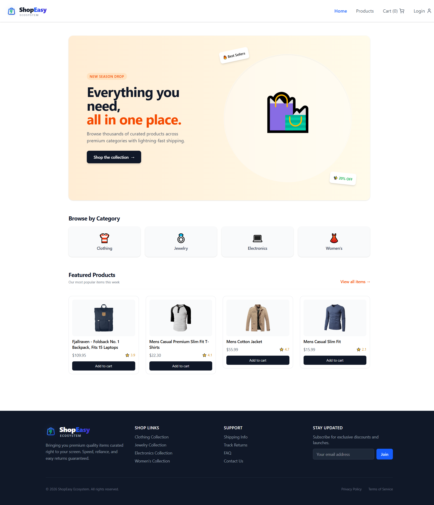
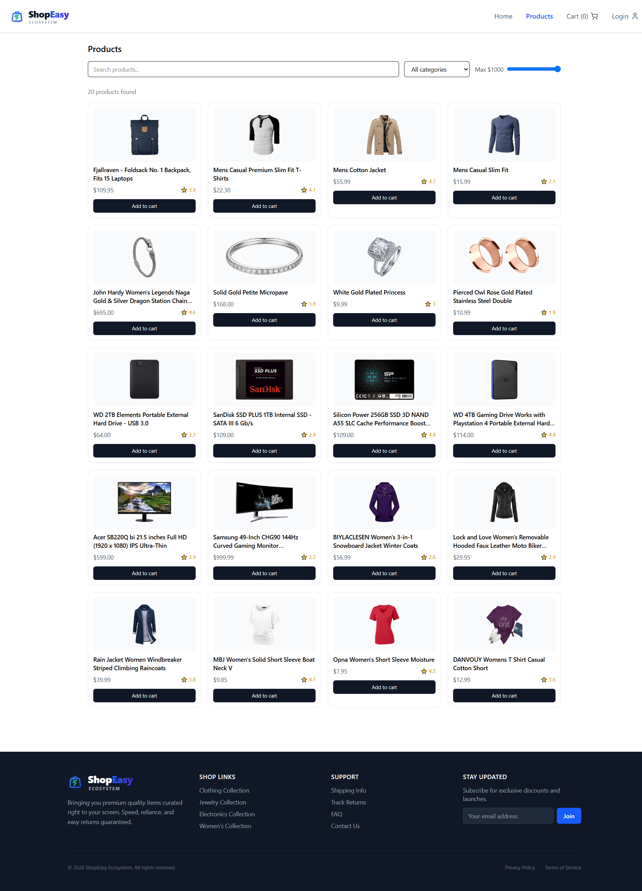
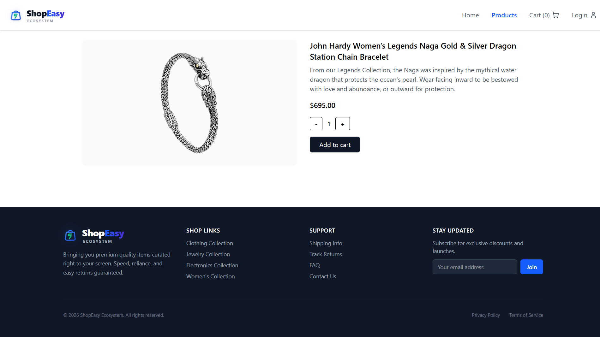
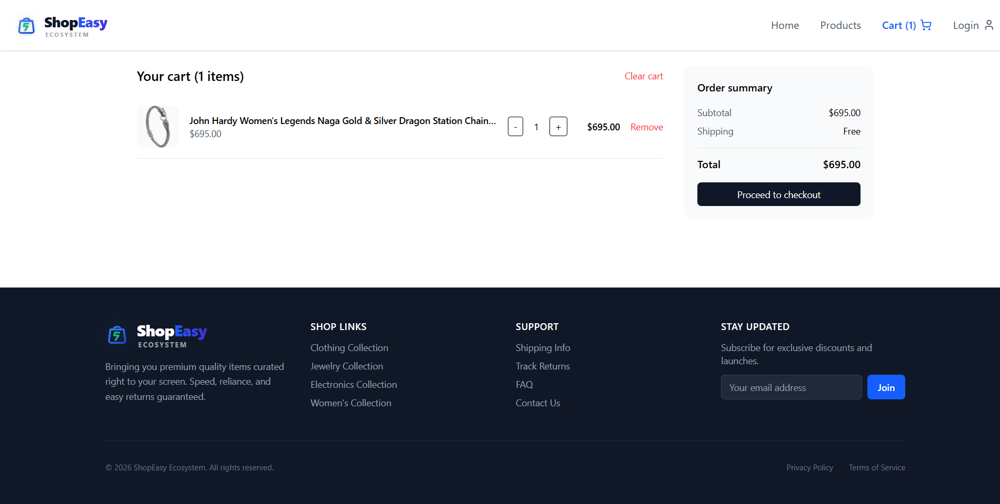
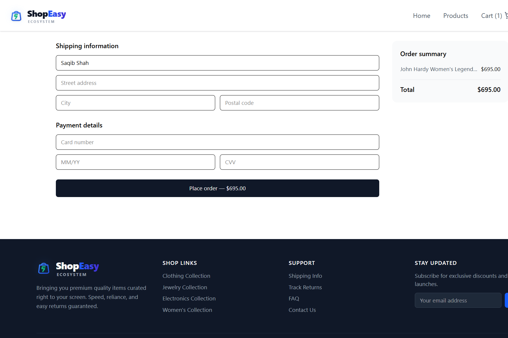
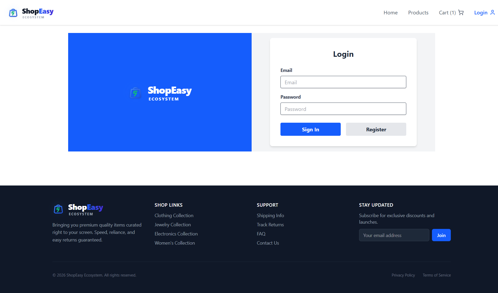
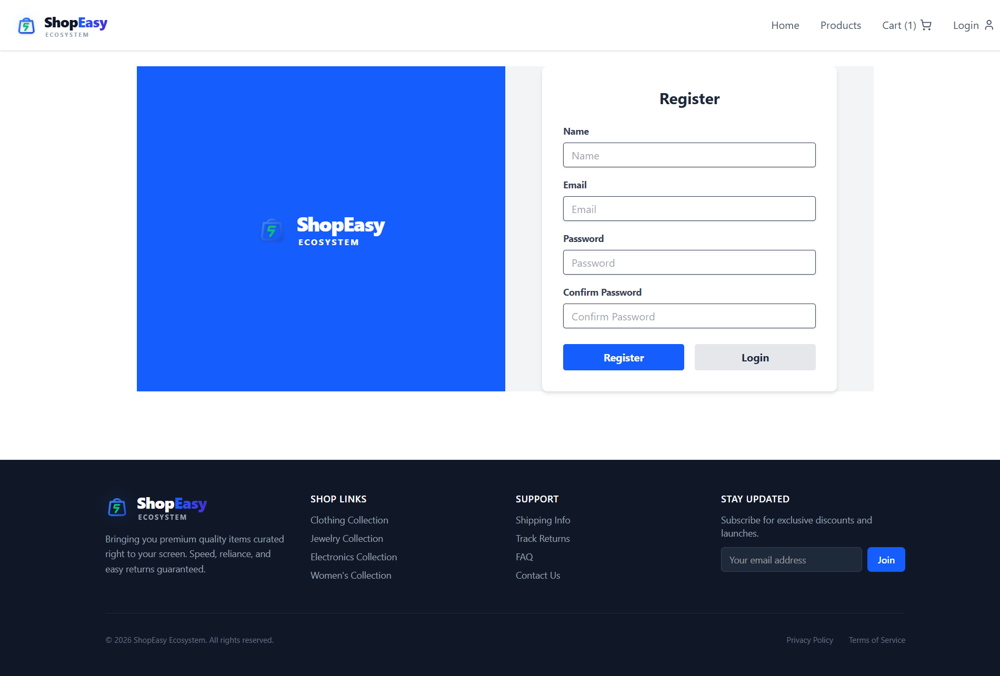

# ShopEasy - E-Commerce Application

A modern, fully responsive E-Commerce front-end web application built with React, Vite, and TailwindCSS. 

##  Features

- **Product Discovery**: Browse thousands of products across categories (Clothing, Jewelry, Electronics, Women's).
- **Product Details**: Detailed view of each product with dynamic pricing and descriptions.
- **Cart Management**: Add, remove, and update quantities of items in your shopping cart.
- **User Authentication**: Login and Registration forms with protected routes.
- **Secure Checkout**: Dedicated, protected checkout process for finalizing orders.
- **Responsive Design**: Looks great on desktop, tablet, and mobile devices.

## Tech Stack

- **Framework**: [React 19](https://react.dev/) with [Vite](https://vitejs.dev/)
- **Routing**: [React Router DOM](https://reactrouter.com/)
- **State Management**: [Zustand](https://zustand-demo.pmnd.rs/)
- **Styling**: [TailwindCSS v4](https://tailwindcss.com/)
- **Data Fetching**: [React Query](https://tanstack.com/query/latest)
- **Icons**: [Lucide React](https://lucide.dev/)
- **Notifications**: [React Hot Toast](https://react-hot-toast.com/)

##  Screenshots

### Home Page


### Products Page


### Product Detail


### Cart


### Checkout


### Authentication
**Login:**


**Register:**


## Installation & Setup

1. **Clone the repository**
   ```bash
   git clone <repository-url>
   cd ecommerce-app
   ```

2. **Install dependencies**
   ```bash
   npm install
   ```

3. **Run the development server**
   ```bash
   npm run dev
   ```

4. **Build for production**
   ```bash
   npm run build
   ```

