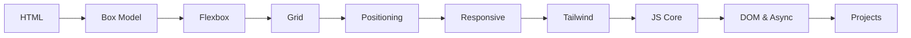

<div align="center">

# Web Development Learning Journey

**A free, hands-on roadmap from HTML basics to real JavaScript projects — built while learning, shared for beginners.**

[](./HTML)
[](./CSS)
[](./JS)
[](https://code.visualstudio.com/)
[](https://git-scm.com/)

[Get Started](#quick-start) · [Learning Path](#suggested-learning-path) · [Projects](#mini-projects) · [FAQ](#faq)

</div>

---

## Why This Repo Exists

I built this repository as my **personal learning notebook** while studying web development. Every file is real practice code — not copy-pasted tutorials.

| For me | For you |
|:---|:---|
| Track what I learn, phase by phase | Follow a clear path from zero to projects |
| Save exercises and notes in one place | Open, edit, and run every example locally |
| Build toward full-stack development | Learn the same foundations every developer needs |

> **No frameworks. No build tools. No npm install.**  
> Just **HTML**, **CSS**, and **JavaScript** — open a file in your browser and start learning.

If I can learn it, so can you.

---

## Highlights

- **Beginner-friendly** — starts from absolute basics, no prior coding required
- **12 structured phases** — HTML → CSS → JavaScript in the right order
- **70+ practice files** — playgrounds, tasks, exercises, and annotated notes
- **3 mini projects** — To-Do List, GitHub Profile Search, Netflix landing page clone
- **Commented code** — every file explains *what* it does and *why*
- **Living notebook** — updated as new topics are learned

---

## Who Is This For?

| You are... | Start here |
|:---|:---|
| **Complete beginner** | [Quick Start](#quick-start) → [HTML folder](./HTML) |
| **Know basic HTML** | [CSS Box Model](./CSS/Box%20Model) |
| **Comfortable with CSS** | [JavaScript folder](./JS) |
| **Self-learner** | [Suggested Learning Path](#suggested-learning-path) |
| **Looking for practice** | [Mini Projects](#mini-projects) |

---

## Repository at a Glance

| Track | What's inside | Folder |
|:---|:---|:---|
| **HTML** | Semantic tags, forms, tables, media, layouts | [`/HTML`](./HTML) |
| **CSS** | Box model, Flexbox, Grid, responsive design, Tailwind, BEM | [`/CSS`](./CSS) |
| **JavaScript** | Variables, functions, DOM, async, ES6, event loop | [`/JS`](./JS) |

**Detailed guides per folder:** [HTML](./HTML/README.md) · [CSS](./CSS/README.md) · [JavaScript](./JS/README.md)

---

## Suggested Learning Path

Follow these phases in order — each one builds on the last.



| Step | Topic | Practice | Go to |
|:---:|:---|:---|:---|
| 1 | Page structure | Tags, forms, semantic layout | [HTML](./HTML) |
| 2 | Spacing & sizing | Padding, margins, box model | [Box Model](./CSS/Box%20Model) |
| 3 | 1D layouts | Navbars, card rows | [Flexbox](./CSS/Flex%20Box) |
| 4 | 2D layouts | Galleries, page grids | [CSS Grid](./CSS/grid) |
| 5 | Element control | Fixed nav, modals, badges | [Positioning](./CSS/Positioning%20Types) |
| 6 | Polish | Variables, transitions, mobile-first | [CSS Advanced](./CSS) |
| 7 | Utility CSS | Rapid styling with classes | [Tailwind](./CSS/Tailwind%20css) |
| 8 | Programming | Variables, functions, arrays | [JavaScript](./JS) |
| 9 | Interactivity | Events, API calls, async | [JS Advanced](./JS) |
| 10 | Real apps | Combine everything | [Projects](#mini-projects) |

---

## Quick Start

**You need:** [VS Code](https://code.visualstudio.com/) + a modern browser (Chrome, Firefox, or Edge).

```bash
# 1. Clone
git clone https://github.com/SaqibShah-dev/web-dev-journey.git
cd web-dev-journey

# 2. Open in VS Code
code .
```

**3. Install Live Server** — VS Code Extensions (`Ctrl+Shift+X`) → search **Live Server** by Ritwick Dey → Install.

**4. Run your first file**

1. Open [`HTML/TextTags.html`](./HTML/TextTags.html)
2. Right-click → **Open with Live Server**
3. Edit and save — the browser refreshes automatically

**5. For JavaScript files**

Open the `index.html` (or topic `.html`) inside any JS folder → Live Server → press `F12` → **Console** tab.

---

## Curriculum

<details open>
<summary><strong>Phase 1 — HTML Basics</strong> · <a href="./HTML">/HTML</a> · <a href="./HTML/README.md">guide</a></summary>

<br>

| File | Topic |
|:---|:---|
| [MetaTags.html](./HTML/MetaTags.html) | Page config, encoding, viewport |
| [TextTags.html](./HTML/TextTags.html) | Headings, paragraphs, emphasis |
| [Lists.html](./HTML/Lists.html) | Ordered, unordered, nested lists |
| [divContainer.html](./HTML/divContainer.html) | Block vs inline elements |
| [LinksImages.html](./HTML/LinksImages.html) | Links and images with `alt` text |
| [Tables.html](./HTML/Tables.html) | Semantic tables |
| [Multimedia.html](./HTML/Multimedia.html) | Audio and video |
| [Forms.html](./HTML/Forms.html) | Inputs, labels, buttons |
| [simple_page_layout.html](./HTML/simple_page_layout.html) | Full semantic page layout |
| [practice_project.html](./HTML/practice_project.html) | Combined practice project |

</details>

<details>
<summary><strong>Phases 2–8 — CSS Layouts & Styling</strong> · <a href="./CSS">/CSS</a> · <a href="./CSS/README.md">guide</a></summary>

<br>

**Phase 2 — Box Model** · [`/CSS/Box Model`](./CSS/Box%20Model)
- [Box_model.html](./CSS/Box%20Model/Box_model.html) — interactive sizing demo
- [Margin collapse guide](./CSS/Box%20Model/solution_for_margin_collapse.txt)
- [Approaches 1–4](./CSS/Box%20Model/) and [Tasks 1–5](./CSS/Box%20Model/)

**Phase 3 — Flexbox** · [`/CSS/Flex Box`](./CSS/Flex%20Box)
- [understand_flex.html](./CSS/Flex%20Box/understand_flex.html) — core concepts
- [Playgrounds](./CSS/Flex%20Box/) — `justify-content`, `align-items`, `gap`
- [Navbar_task.html](./CSS/Flex%20Box/Navbar_task.html) · [Full_page_layout.html](./CSS/Flex%20Box/Full_page_layout.html)

**Phase 4 — CSS Grid** · [`/CSS/grid`](./CSS/grid)
- [css_grid_fundamental.html](./CSS/grid/css_grid_fundamental.html)
- [repeat.html](./CSS/grid/repeat.html) · [auto-fit-and-auto-fill.html](./CSS/grid/auto-fit-and-auto-fill.html)
- [image-gallery-prject.html](./CSS/grid/image-gallery-prject.html) — masonry gallery

**Phase 5 — Positioning** · [`/CSS/Positioning Types`](./CSS/Positioning%20Types)
- [Concept guide](./CSS/Positioning%20Types/css-position-property-explain.txt)
- [Badge-on-Icon](./CSS/Positioning%20Types/Task1—Badge-on-Icon.html) · [Modal](./CSS/Positioning%20Types/Modal.html)

**Phases 6–8 — Variables, Responsive & BEM**
- [CSS Variables](./CSS/CSS-Variables+Transitions+Pseudo-classes/CSS-variables.html) · [Pseudo-classes](./CSS/CSS-Variables+Transitions+Pseudo-classes/Pseudo-classes.html) · [Transitions](./CSS/CSS-Variables+Transitions+Pseudo-classes/Transition-property.html)
- [Responsive design/](./CSS/Responsive%20design) — mobile-first, media queries
- [css-architecture/](./CSS/css-architecture) — BEM naming (`block__element--modifier`)
- [Floating_label/](./CSS/Floating_label) — animated form labels

</details>

<details>
<summary><strong>Phase 9 — Tailwind CSS</strong> · <a href="./CSS/Tailwind%20css">/CSS/Tailwind css</a></summary>

<br>

| File | Topic |
|:---|:---|
| [Learning-Tailwind-css.txt](./CSS/Tailwind%20css/Learning-Tailwind-css.txt) | Setup and install |
| [Using-Tailwind-CSS.html](./CSS/Tailwind%20css/Using-Tailwind-CSS.html) | Utility classes |
| [Responsive-Design-in-Tailwind.html](./CSS/Tailwind%20css/Responsive-Design-in-Tailwind.html) | `sm:` `md:` `lg:` breakpoints |
| [Project.html](./CSS/Tailwind%20css/Project.html) | Full landing page |

</details>

<details>
<summary><strong>Phase 10 — CSS Anchor Positioning</strong> · <a href="./CSS/Anchor-Positioning">/CSS/Anchor-Positioning</a></summary>

<br>

- [Anchor-positioning-template.html](./CSS/Anchor-Positioning/Anchor-positioning-template.html) — tooltips with `anchor-name` and `position-anchor`

</details>

<details>
<summary><strong>Phase 11 — JavaScript Fundamentals</strong> · <a href="./JS">/JS</a> · <a href="./JS/README.md">guide</a></summary>

<br>

| Topic | File | Concepts |
|:---|:---|:---|
| Variables | [variable-and-types.js](./JS/variable-and-types/variable-and-types.js) | `let`/`const`, primitives, `typeof`, `===` |
| Functions | [function.js](./JS/functions/function.js) | arrows, closures, `call`/`apply`/`bind`, hoisting |
| Arrays | [arrays.js](./JS/arrays/arrays.js) | `map`, `filter`, `reduce`, spread, destructuring |
| Objects | [objects.js](./JS/Objects/objects.js) | keys/values, optional chaining, `this` |
| Scope | [scopeAndClosure.js](./JS/scopeAndClosure/scopeAndClosure.js) | lexical scope, private variables |
| ES6 | [templateLiterals](./JS/ES6/templateLiterals/templateLiterals.js) · [modules](./JS/ES6/modules/modules.js) · [optionalChaining](./JS/ES6/optionalChaining/optionalChaining.js) | modern syntax |

</details>

<details>
<summary><strong>Phase 12 — DOM, Async & How JS Works</strong></summary>

<br>

| Topic | File |
|:---|:---|
| DOM manipulation | [dom-manipulation.js](./JS/DOM-Manipulation/dom-manipulation.js) · [exercise.js](./JS/DOM-Manipulation/exercise.js) |
| Async JS | [Async.js](./JS/AsyncJS/Async.js) · [exerciseTask.js](./JS/AsyncJS/exerciseTask.js) |
| Call stack | [callstack.js](./JS/callstack/callstack.js) |
| Event loop | [eventLoop.js](./JS/EventLoop/eventLoop.js) |
| Engine notes | [howJSWorks.txt](./JS/howJSWorks.txt) |

</details>

---

## Mini Projects

Small apps that combine HTML, CSS, and JavaScript.

| Project | What it does | Folder |
|:---|:---|:---|
| **To-Do List** | Add, complete, and delete tasks | [`/JS/to-do-list`](./JS/to-do-list) |
| **GitHub Profile Search** | Fetch and display any GitHub user via API | [`/JS/githubProfileSearch`](./JS/githubProfileSearch) |
| **Netflix Landing Page** | Responsive homepage clone (HTML + CSS only) | [`/CSS/Netflix Landing Page`](./CSS/Netflix%20Landing%20Page) |

<details>
<summary><strong>Project file breakdown</strong></summary>

<br>

**To-Do List**
- [to_do_list.html](./JS/to-do-list/to_do_list.html) · [to_do_list.js](./JS/to-do-list/to_do_list.js) · [to_do_list.css](./JS/to-do-list/to_do_list.css)

**GitHub Profile Search**
- [githubProfileSearch.html](./JS/githubProfileSearch/githubProfileSearch.html) · [githubProfileSearch.js](./JS/githubProfileSearch/githubProfileSearch.js) · [githubProfileSearch.css](./JS/githubProfileSearch/githubProfileSearch.css)

**Netflix Clone**
- [Netflix-Landing-page.html](./CSS/Netflix%20Landing%20Page/Netflix-Landing-page.html) · [style.css](./CSS/Netflix%20Landing%20Page/style.css)

</details>

---

## Learning Progress

### Completed

- [x] HTML5 semantic structuring
- [x] CSS: box model, Flexbox, Grid, positioning
- [x] CSS: responsive design, BEM, variables, transitions
- [x] Tailwind CSS and anchor positioning
- [x] JavaScript: variables, functions, arrays, objects, ES6, closures
- [x] DOM manipulation, async/await, event loop, call stack
- [x] Mini projects: to-do list, GitHub search, Netflix clone

### Coming Next

- [ ] Git & GitHub workflows
- [ ] React.js and component state
- [ ] Full-stack MERN (Node.js, Express, MongoDB)

---

## Tips for Beginners

1. **Follow the phases in order** — HTML → CSS → JavaScript.
2. **Use DevTools (`F12`)** — Console for JS output, Elements for CSS inspection.
3. **Break things on purpose** — change values, see what breaks, fix it.
4. **Read the comments** in every file before changing code.
5. **Type code yourself** — don't just read; muscle memory matters.
6. **Finish one phase** before jumping to the next.

---

## FAQ

<details>
<summary><strong>Do I need to learn HTML before CSS?</strong></summary>

Yes. Learn HTML tags first so you have something to style. Once you can build a basic form and page layout, move to CSS.

</details>

<details>
<summary><strong>What is the difference between Flexbox and Grid?</strong></summary>

**Flexbox** lays out items in one direction (e.g. a row of nav links). **Grid** handles rows and columns together (e.g. a full page layout).

</details>

<details>
<summary><strong>Why does my JavaScript page look blank?</strong></summary>

Many JS files log to the **console**, not the page. Open the folder's HTML file with Live Server, press `F12`, and check the **Console** tab.

</details>

<details>
<summary><strong>Can I use this code in my own projects?</strong></summary>

Yes. Fork the repo or copy any file. Use [`simple_page_layout.html`](./HTML/simple_page_layout.html) as a starter template.

</details>

<details>
<summary><strong>Is this repo finished?</strong></summary>

No — it's a living notebook. I add topics as I learn them. See [Learning Progress](#learning-progress) for what's next.

</details>

---

## Contributing

Contributions that help beginners learn are welcome.

1. Fork this repository
2. `git checkout -b feature/your-improvement`
3. `git commit -m "docs: your change description"`
4. `git push origin feature/your-improvement`
5. Open a Pull Request

---

## About the Author

| | |
|:---|:---|
| **Name** | Saqib Shah |
| **Education** | BS Artificial Intelligence (Undergraduate) |
| **Institution** | BIIT — Barani Institute of Information Technology |
| **University** | PMAS Arid Agriculture University (PMAS AAUR) |
| **Location** | Pakistan |
| **Goal** | Master full-stack web development and help others on the same path |

---

## License

Free to use, copy, and modify for learning and personal projects.

---

<div align="center">

**If this repo helps you, give it a star — it helps other learners find it too.**

Built with dedication by [**Saqib Shah**](https://github.com/SaqibShah-dev)

</div>
