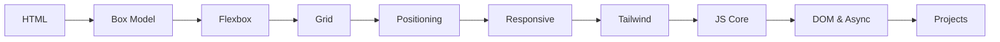

<div align="center">

# Web Development Learning Journey

**Learn web development from zero — HTML, CSS, and JavaScript with 70+ hands-on files and real mini projects.**

[](https://github.com/SaqibShah-dev/web-dev-journey/stargazers)
[](https://github.com/SaqibShah-dev/web-dev-journey/network/members)

[](./HTML)
[](./CSS)
[](./JS)
[](https://code.visualstudio.com/)

**[⭐ Star this repo](https://github.com/SaqibShah-dev/web-dev-journey)** · [Get Started](#quick-start) · [Learning Path](#suggested-learning-path) · [Curriculum](#curriculum) · [Projects](#mini-projects) · [FAQ](#faq)

</div>

---

## Table of Contents

- [About](#about)
- [At a Glance](#at-a-glance)
- [Who Should Use This](#who-should-use-this)
- [How to Study](#how-to-study-with-this-repo)
- [Suggested Learning Path](#suggested-learning-path)
- [Quick Start](#quick-start)
- [Curriculum](#curriculum)
- [Mini Projects](#mini-projects)
- [Learning Progress](#learning-progress)
- [Tips for Beginners](#tips-for-beginners)
- [Common Mistakes](#common-mistakes)
- [Helpful Resources](#helpful-resources)
- [Keyboard Shortcuts](#keyboard-shortcuts)
- [FAQ](#faq)
- [Contributing](#contributing)

---

## About

This is my **personal learning notebook** for web development. I document topics as I learn them and share the code so beginners can follow a clear, practical path — not just theory.

| | |
|:---|:---|
| **Built for** | Beginners, students, and self-learners starting web development |
| **Stack** | HTML5 · CSS3 · JavaScript (vanilla — no React, no Node required) |
| **Format** | Runnable `.html` files, annotated exercises, and mini projects |
| **Cost** | Free — fork, copy, and learn |

> **No frameworks. No build tools. No npm install.**  
> Open a file → run it in the browser → read the comments → change something → see what happens.

---

## At a Glance

| | |
|:---|:---:|
| Learning phases | **12** |
| Practice files | **70+** |
| Mini projects | **3** |
| Prior experience needed | **None** |

| Track | Topics | Start here |
|:---|:---|:---|
| **HTML** | Tags, forms, tables, semantic layouts | [`/HTML`](./HTML) |
| **CSS** | Box model, Flexbox, Grid, responsive, Tailwind | [`/CSS`](./CSS) |
| **JavaScript** | Variables, DOM, async, ES6, event loop | [`/JS`](./JS) |

Folder guides: [HTML](./HTML/README.md) · [CSS](./CSS/README.md) · [JavaScript](./JS/README.md)

---

## Who Should Use This?

| If you are... | Start here |
|:---|:---|
| **Brand new to coding** | [Quick Start](#quick-start) → [`HTML/TextTags.html`](./HTML/TextTags.html) |
| **Know HTML, need styling** | [CSS Box Model](./CSS/Box%20Model) |
| **Know CSS, ready for JS** | [JavaScript folder](./JS) |
| **Want real projects first** | [Mini Projects](#mini-projects) |
| **Want the full roadmap** | [Suggested Learning Path](#suggested-learning-path) |

---

## How to Study With This Repo

```
1. Pick a phase     →  Follow the learning path in order
2. Open the file    →  Use Live Server in VS Code
3. Read comments    →  Understand before you edit
4. Break & rebuild  →  Change values, fix errors, experiment
```

**Tools you need:** [VS Code](https://code.visualstudio.com/) · a modern browser · [Live Server extension](https://marketplace.visualstudio.com/items?itemName=ritwickdey.LiveServer) · [Git](https://git-scm.com/) (to clone)

---

## Suggested Learning Path



| Step | Phase | You will practice | Folder | ⏱️ Time |
|:---:|:---|:---|:---|:---|
| 1 | HTML | Tags, forms, page structure | [HTML](./HTML) | 3–4 hrs |
| 2 | Box Model | Padding, margins, spacing | [Box Model](./CSS/Box%20Model) | 2–3 hrs |
| 3 | Flexbox | Navbars, card rows | [Flex Box](./CSS/Flex%20Box) | 4–5 hrs |
| 4 | Grid | Galleries, 2D layouts | [grid](./CSS/grid) | 4–5 hrs |
| 5 | Positioning | Modals, badges, sticky nav | [Positioning Types](./CSS/Positioning%20Types) | 2–3 hrs |
| 6 | Advanced CSS | Variables, responsive, BEM | [CSS](./CSS) | 3–4 hrs |
| 7 | Tailwind | Utility-first styling | [Tailwind css](./CSS/Tailwind%20css) | 2–3 hrs |
| 8 | JS basics | Variables, functions, arrays | [JS](./JS) | 6–8 hrs |
| 9 | JS advanced | DOM, promises, async/await | [JS](./JS) | 6–8 hrs |
| 10 | Projects | Build real apps | [Projects](#mini-projects) | 8–12 hrs |

<details>
<summary><strong>Full folder tree</strong></summary>

```
Learning/
├── HTML/                   # Phase 1 — 10 practice files
├── CSS/                    # Phases 2–10 — layouts & styling
│   ├── Box Model/
│   ├── Flex Box/
│   ├── grid/
│   ├── Positioning Types/
│   ├── Responsive design/
│   ├── Tailwind css/
│   └── Netflix Landing Page/
└── JS/                     # Phases 11–12 — logic & apps
    ├── variable-and-types/
    ├── functions/
    ├── ES6/
    ├── DOM-Manipulation/
    ├── AsyncJS/
    ├── to-do-list/
    └── githubProfileSearch/
```

</details>

---

## Quick Start

```bash
git clone https://github.com/SaqibShah-dev/web-dev-journey.git
cd web-dev-journey
code .
```

1. Install **Live Server** in VS Code (`Ctrl+Shift+X` → search "Live Server")
2. Open [`HTML/TextTags.html`](./HTML/TextTags.html)
3. Right-click → **Open with Live Server**
4. Edit and save — the browser refreshes automatically

**JavaScript files:** open the folder's `.html` file → Live Server → `F12` → **Console** tab.

---

## Curriculum

<details>
<summary><strong>Phase 1 — HTML Basics</strong> · <a href="./HTML">/HTML</a></summary>

| File | Topic |
|:---|:---|
| [MetaTags.html](./HTML/MetaTags.html) | Page config, encoding, viewport |
| [TextTags.html](./HTML/TextTags.html) | Headings, paragraphs, emphasis |
| [Lists.html](./HTML/Lists.html) | Ordered & unordered lists |
| [divContainer.html](./HTML/divContainer.html) | Block vs inline elements |
| [LinksImages.html](./HTML/LinksImages.html) | Links and images |
| [Tables.html](./HTML/Tables.html) | Semantic tables |
| [Multimedia.html](./HTML/Multimedia.html) | Audio and video |
| [Forms.html](./HTML/Forms.html) | Inputs, labels, buttons |
| [simple_page_layout.html](./HTML/simple_page_layout.html) | Full semantic layout |
| [practice_project.html](./HTML/practice_project.html) | Combined project |

</details>

<details>
<summary><strong>Phases 2–8 — CSS Layouts & Styling</strong> · <a href="./CSS">/CSS</a></summary>

| Phase | Folder | Key files |
|:---:|:---|:---|
| 2 | [Box Model](./CSS/Box%20Model/) | [Box_model.html](./CSS/Box%20Model/Box_model.html), margin collapse guide |
| 3 | [Flex Box](./CSS/Flex%20Box/) | [understand_flex.html](./CSS/Flex%20Box/understand_flex.html), [Navbar_task.html](./CSS/Flex%20Box/Navbar_task.html) |
| 4 | [grid](./CSS/grid/) | [css_grid_fundamental.html](./CSS/grid/css_grid_fundamental.html), [image-gallery-project.html](./CSS/grid/image-gallery-project.html) |
| 5 | [Positioning Types](./CSS/Positioning%20Types/) | [Badge-on-Icon](./CSS/Positioning%20Types/Task1—Badge-on-Icon.html), [Modal](./CSS/Positioning%20Types/Modal.html) |
| 6–8 | [Variables](./CSS/CSS-Variables+Transitions+Pseudo-classes/), [Responsive](./CSS/Responsive%20design/), [BEM](./CSS/css-architecture/) | Transitions, media queries, naming conventions |

</details>

<details>
<summary><strong>Phase 9 — Tailwind CSS</strong> · <a href="./CSS/Tailwind%20css">/CSS/Tailwind css</a></summary>

| File | Topic |
|:---|:---|
| [Using-Tailwind-CSS.html](./CSS/Tailwind%20css/Using-Tailwind-CSS.html) | Utility classes |
| [Responsive-Design-in-Tailwind.html](./CSS/Tailwind%20css/Responsive-Design-in-Tailwind.html) | Breakpoints |
| [Project.html](./CSS/Tailwind%20css/Project.html) | Landing page project |

</details>

<details>
<summary><strong>Phase 10 — CSS Anchor Positioning</strong></summary>

- [Anchor-positioning-template.html](./CSS/Anchor-Positioning/Anchor-positioning-template.html) — modern tooltips with `anchor-name`

</details>

<details>
<summary><strong>Phase 11 — JavaScript Fundamentals</strong> · <a href="./JS">/JS</a></summary>

| Topic | File |
|:---|:---|
| Variables & types | [variable-and-types.js](./JS/variable-and-types/variable-and-types.js) |
| Functions | [function.js](./JS/functions/function.js) |
| Arrays | [arrays.js](./JS/arrays/arrays.js) |
| Objects | [objects.js](./JS/Objects/objects.js) |
| Scope & closures | [scopeAndClosure.js](./JS/scopeAndClosure/scopeAndClosure.js) |
| ES6 | [templateLiterals](./JS/ES6/templateLiterals/templateLiterals.js) · [modules](./JS/ES6/modules/modules.js) · [optionalChaining](./JS/ES6/optionalChaining/optionalChaining.js) |

</details>

<details>
<summary><strong>Phase 12 — DOM, Async & How JS Works</strong></summary>

| Topic | File |
|:---|:---|
| DOM manipulation | [dom-manipulation.js](./JS/DOM-Manipulation/dom-manipulation.js) |
| Async JavaScript | [Async.js](./JS/AsyncJS/Async.js) |
| Call stack | [callstack.js](./JS/callstack/callstack.js) |
| Event loop | [eventLoop.js](./JS/EventLoop/eventLoop.js) |
| Engine notes | [howJSWorks.txt](./JS/howJSWorks.txt) |

</details>

---

## Mini Projects

| Project | Skills | Tech | Open |
|:---|:---|:---|:---|
| **To-Do List** | DOM events, add/delete tasks | HTML · CSS · JS | [`/JS/to-do-list`](./JS/to-do-list) |
| **GitHub Profile Search** | API fetch, dynamic rendering | HTML · CSS · JS · Fetch API | [`/JS/githubProfileSearch`](./JS/githubProfileSearch) |
| **Netflix Landing Page** | Grid, responsive, accordion UI | HTML · CSS | [`/CSS/Netflix Landing Page`](./CSS/Netflix%20Landing%20Page) |

---

## Learning Progress

**Completed**
- [x] HTML5 · CSS layouts · Responsive design · Tailwind · BEM
- [x] JavaScript fundamentals · DOM · async/await · event loop
- [x] Mini projects: To-Do List, GitHub Search, Netflix clone

**Coming next**
- [ ] Git & GitHub workflows
- [ ] React.js
- [ ] Full-stack MERN

---

## Tips for Beginners

1. **Go in order** — HTML → CSS → JavaScript
2. **Use DevTools (`F12`)** — Console for JS, Elements for CSS
3. **Read comments first**, then edit the code
4. **Type it yourself** — don't just read files
5. **One phase at a time** — finish before jumping ahead

---

## Common Mistakes

| Mistake | Why it happens | How to fix |
|:---|:---|:---|
| **CSS not updating** | Browser cache. File not saved. | Use `Ctrl+Shift+R` (hard refresh) or open DevTools with `F12` |
| **JS page is blank** | Code runs in Console, not the page | Open with Live Server, press `F12`, check the **Console** tab |
| **Grid/Flexbox not working** | Parent lacks `display: grid/flex` | Always set the container, not the children |
| **`position` not working** | Position is `static` by default | Use `position: absolute/relative/fixed` |
| **Images not loading** | Wrong file path or case sensitivity | Use relative paths: `../images/photo.jpg` |
| **Form not submitting** | No `<form>` tag or missing `type="submit"` | Wrap inputs in `<form>` and use `<button type="submit">` |

---

## Helpful Resources

### Documentation
- [MDN Web Docs](https://developer.mozilla.org/) — Authoritative HTML/CSS/JS reference
- [web.dev](https://web.dev/) — Modern web standards and best practices
- [CSS-Tricks](https://css-tricks.com/) — Clear tutorials and guides
- [DevDocs](https://devdocs.io/) — Fast offline documentation

### Tools
- [VS Code](https://code.visualstudio.com/) — Free code editor
- [Figma](https://www.figma.com/) — UI design and prototyping
- [Can I Use](https://caniuse.com/) — Browser compatibility checker
- [CSS Validation](https://jigsaw.w3.org/css-validator/) — Validate your CSS

### Interactive Learning
- [Codecademy](https://www.codecademy.com/) — Interactive coding courses
- [Freecodecamp](https://www.freecodecamp.org/) — Free tutorials
- [W3Schools](https://www.w3schools.com/) — Quick reference with examples

---

## Keyboard Shortcuts

### VS Code (Windows/Linux)

| Shortcut | Action |
|:---|:---|
| `Ctrl+Shift+X` | Open Extensions marketplace |
| `Ctrl+Shift+P` | Command Palette (search for "Live Server") |
| `Ctrl+/` | Toggle comment |
| `Shift+Alt+F` | Format document |
| `Ctrl+D` | Select next matching text |
| `Ctrl+H` | Find & replace |
| `F12` | Open Browser DevTools |
| `Ctrl+Shift+I` | Open Browser DevTools (alternative) |

### Browser DevTools

| Key | Action |
|:---|:---|
| `F12` or `Ctrl+Shift+I` | Toggle DevTools |
| `Ctrl+Shift+C` | Inspect element |
| `Ctrl+Shift+J` | Open Console tab |
| `Ctrl+Shift+E` | Open Elements/Inspector tab |
| `Ctrl+R` | Refresh page |
| `Ctrl+Shift+R` | Hard refresh (clear cache) |

---

## FAQ

<details>
<summary><strong>Do I need HTML before CSS?</strong></summary>

Yes. Build a basic page and form in HTML first, then style it with CSS.

</details>

<details>
<summary><strong>Flexbox vs Grid — which one?</strong></summary>

Use **Flexbox** for one-direction layouts (navbars, card rows). Use **Grid** when you need rows and columns together (page layouts, galleries).

</details>

<details>
<summary><strong>Why is my JS page blank?</strong></summary>

Most JS lessons log to the **Console**, not the page. Open the HTML file with Live Server, press `F12`, and check the Console tab.

</details>

<details>
<summary><strong>Can I use this code freely?</strong></summary>

Yes. Fork, copy, or adapt any file for learning and practice. Start new pages from [`simple_page_layout.html`](./HTML/simple_page_layout.html).

</details>

<details>
<summary><strong>Is this repo finished?</strong></summary>

No — it is a living notebook. I add new topics as I learn them. See [Learning Progress](#learning-progress) for what is coming next.

</details>

---

## Contributing

Found a typo or want to add a clearer explanation? Pull requests welcome.

1. Fork the repo
2. `git checkout -b docs/your-change`
3. Commit and push
4. Open a Pull Request

---

## About the Author

**Saqib Shah** — BS Artificial Intelligence student at BIIT (PMAS AAUR), Pakistan.

Learning web development step by step and documenting the journey so others can follow along.

[](https://github.com/SaqibShah-dev)

---

<div align="center">

**If this repo helped you learn something, [give it a star ⭐](https://github.com/SaqibShah-dev/web-dev-journey) — it helps other beginners find it.**

</div>