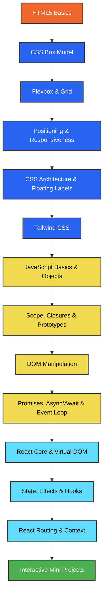

<div align="center">

# Web Development & React.js Learning Journey

**A comprehensive, highly-structured repository documenting my progression from absolute zero to building modern front-end web applications with HTML5, CSS3, JavaScript (ES6+), and React.js.**

*Featuring 130+ practice files, detailed study guides, and interactive mini-projects.*

[](https://github.com/SaqibShah-dev/web-dev-journey/stargazers)
[](https://github.com/SaqibShah-dev/web-dev-journey/network/members)
[](https://github.com/SaqibShah-dev/web-dev-journey/issues)

[](./HTML)
[](./CSS)
[](./JS)
[](./React_JS)

**[⭐ Star this repository](https://github.com/SaqibShah-dev/web-dev-journey)** · [Quick Start](#-quick-start) · [Roadmap](#%EF%B8%8F-suggested-learning-path) · [Curriculum](#-curriculum) · [Projects](#-mini-projects) · [FAQ](#-faq)

</div>

---

## Table of Contents

- [ About the Project](#-about-the-project)
- [ Repository at a Glance](#-repository-at-a-glance)
- [ Target Audience](#-target-audience)
- [ How to Study with this Repo](#%EF%B8%8F-how-to-study-with-this-repo)
- [ Suggested Learning Path](#%EF%B8%8F-suggested-learning-path)
- [ Quick Start](#-quick-start)
- [ Curriculum](#-curriculum)
  - [HTML5 Basics](#1-html5-basics)
  - [CSS3 Styling & Layouts](#2-css3-styling--layouts)
  - [Tailwind CSS](#3-tailwind-css)
  - [Modern CSS Features](#4-modern-css-features)
  - [JavaScript (ES6+) Core](#5-javascript-es6-core)
  - [DOM, Async & Browser Internals](#6-dom-async--browser-internals)
  - [React.js & Hooks](#7-reactjs--hooks)
- [ Mini Projects](#-mini-projects)
- [ Learning Progress](#-learning-progress)
- [ Tips for Beginners](#-tips-for-beginners)
- [ Common Mistakes & Fixes](#%EF%B8%8F-common-mistakes--fixes)
- [ Helpful Resources](#-helpful-resources)
- [ Keyboard Shortcuts](#%EF%B8%8F-keyboard-shortcuts)
- [ FAQ](#-faq)
- [ Contributing](#-contributing)

---

##  About the Project

This is my **personal learning notebook and practice code registry** for web development. I document topics as I learn them, writing heavily commented code templates and runnable exercises. It serves as a practical blueprint for self-learners and students who want to master front-end technologies through real building, not just reading theory.

| Feature | Details |
| :--- | :--- |
| **Built for** | Beginners, CS students, and self-taught web developers |
| **Pillars** | Semantic HTML5 · Responsive CSS3 & Tailwind · Modern JS (ES6+) · React.js |
| **Format** | Isolated, runnable code files, structured note-sheets, and complete apps |
| **Cost** | 100% Free & Open-source — fork, clone, edit, and experiment |

> [!NOTE]
> **No complex build environments needed for basic files!**  
> Simply open any `.html` file inside HTML/CSS/JS folders directly in your browser or run them using VS Code's Live Server. No `npm install` required until you reach the React section!

---

##  Repository at a Glance

| Metric | Details |
| :--- | :---: |
| Learning Tracks | **4 Core Tracks** (HTML, CSS, JavaScript, React.js) |
| Code Files | **130+ Practice Files & Configurations** |
| Mini Projects | **4 Interactive Projects** |
| Prior Prerequisites | **None** (Starts from absolute ground zero) |

| Track | Core Concepts Covered | Quick Navigation |
| :--- | :--- | :--- |
| **HTML** | Page metadata, form controls, media embedding, semantic structure | [`/HTML`](./HTML) |
| **CSS** | Box Model, Flexbox, CSS Grid, Positions, Transitions, BEM, Tailwind CSS | [`/CSS`](./CSS) |
| **JavaScript** | Data types, Closure, Prototypes, DOM, Event Loop, Promises & Async/Await | [`/JS`](./JS) |
| **React.js** | Virtual DOM, JSX, Props, Hooks (State, Effects, Context, Ref, Reducer), Router | [`/React_JS`](./React_JS) |

*Folder-specific READMEs:* [HTML Guide](./HTML/README.md) · [CSS Guide](./CSS/README.md) · [JavaScript Guide](./JS/README.md)

---

##  Target Audience

| If you are... | Suggested Starting Point |
| :--- | :--- |
| **Brand new to coding** | [Quick Start](#-quick-start) ➔ Start with [`HTML/TextTags.html`](./HTML/TextTags.html) |
| **Comfortable with markup, need styling** | Explore [CSS Box Model](./CSS/Box%20Model) and [Flex Box](./CSS/Flex%20Box) |
| **Looking to master Modern CSS** | Explore [Tailwind CSS](./CSS/Tailwind%20css) and [Anchor Positioning](./CSS/Anchor-Positioning) |
| **Ready for logic and APIs** | Head over to the [JavaScript Track](./JS) |
| **Moving from Vanilla JS to Frameworks** | Study [React.js Introduction](./React_JS/introduction.txt) and [useState](./React_JS/understand_use_state) |

---

##  How to Study with this Repo

```text
1. Select Phase     ➔ Follow the roadmap track in chronological order.
2. Clone & Open     ➔ Pull the repository locally and open in VS Code.
3. Serve Files      ➔ Right-click and launch with the Live Server extension.
4. Read Annotations ➔ Read through the inline comments explaining *why* the code works.
5. Break & Rebuild  ➔ Tweak values, trigger error states, and rebuild components to consolidate learning.
```

**Developer Tooling Checklist:** [VS Code](https://code.visualstudio.com/) · Modern Browser (Chrome/Firefox/Edge) · [Live Server Extension](https://marketplace.visualstudio.com/items?itemName=ritwickdey.LiveServer) · [Git](https://git-scm.com/) · [Node.js & npm](https://nodejs.org/) (for React)

---

##  Suggested Learning Path



---

##  Quick Start

To clone this repository and start playing with the code on your local machine:

```bash
# Clone the repository
git clone https://github.com/SaqibShah-dev/web-dev-journey.git

# Navigate into the project folder
cd web-dev-journey

# Open in VS Code
code .
```

1. Install **Live Server** in VS Code (`Ctrl + Shift + X` ➔ search and install "Live Server").
2. Open [`HTML/TextTags.html`](./HTML/TextTags.html).
3. Right-click inside the editor ➔ click **Open with Live Server**.
4. Change text, hit save (`Ctrl + S`), and see changes reflect instantly in your browser.

---

##  Curriculum

### 1. HTML5 Basics
Discover the foundational skeleton of web pages, semantic layouts, and search engine optimization concepts.

 Directory: [`/HTML`](./HTML)

| Lesson File | Key Concept |
| :--- | :--- |
| [MetaTags.html](./HTML/MetaTags.html) | Document encoding, SEO meta elements, viewport settings for responsiveness. |
| [TextTags.html](./HTML/TextTags.html) | Headings, paragraphs, spans, strong/em styling, and inline typography. |
| [Lists.html](./HTML/Lists.html) | Ordered (`<ol>`), unordered (`<ul>`), and definition lists (`<dl>`). |
| [divContainer.html](./HTML/divContainer.html) | Block vs inline elements, container elements, and layout boundaries. |
| [LinksImages.html](./HTML/LinksImages.html) | Anchor navigation (`<a>`) and image rendering (``) with alt tags. |
| [Tables.html](./HTML/Tables.html) | Semantic tables featuring `<thead>`, `<tbody>`, rows, headers, and cell spans. |
| [Multimedia.html](./HTML/Multimedia.html) | Native audio and video streaming elements with custom attributes. |
| [Forms.html](./HTML/Forms.html) | Input controls, forms validation, textareas, checkboxes, and select dropdowns. |
| [simple_page_layout.html](./HTML/simple_page_layout.html) | Complete semantic frame (`<header>`, `<main>`, `<section>`, `<aside>`, `<footer>`). |
| [practice_project.html](./HTML/practice_project.html) | Comprehensive review project merging all core HTML elements. |

---

### 2. CSS3 Styling & Layouts
Learn how to style web pages, manage spacing, configure layouts using grid systems, and implement responsiveness.

Directory: [`/CSS`](./CSS)

| Topic | Folder | Core Files |
| :--- | :--- | :--- |
| **Box Model** | [Box Model](./CSS/Box%20Model/) | [Box_model.html](./CSS/Box%20Model/Box_model.html) · Spacing strategies · Margin collapses |
| **Flexbox Layouts** | [Flex Box](./CSS/Flex%20Box/) | [understand_flex.html](./CSS/Flex%20Box/understand_flex.html) · [Navbar_task.html](./CSS/Flex%20Box/Navbar_task.html) · [card_grid_task2.html](./CSS/Flex%20Box/card_grid_task2.html) |
| **Grid Layouts** | [grid](./CSS/grid/) | [css_grid_fundamental.html](./CSS/grid/css_grid_fundamental.html) · [image-gallery-prject.html](./CSS/grid/image-gallery-prject.html) · [auto-fit-and-auto-fill.html](./CSS/grid/auto-fit-and-auto-fill.html) |
| **Positioning** | [Positioning Types](./CSS/Positioning%20Types/) | [Task1—Badge-on-Icon.html](./CSS/Positioning%20Types/Task1—Badge-on-Icon.html) · [Modal.html](./CSS/Positioning%20Types/Modal.html) · Sticky Navbars |
| **Responsive Design**| [Responsive design](./CSS/Responsive%20design/) | Media queries · [Task1—Fluid-Typography.html](./CSS/Responsive%20design/Task1—Fluid-Typography.html) · Mobile-first rules |
| **CSS Architecture** | [css-architecture](./CSS/css-architecture/) | [Block-Element-Modifier.html](./CSS/css-architecture/Block-Element-Modifier.html) (BEM styling methodology) |

---

### 3. Tailwind CSS
Transition from vanilla styles to the modern, rapid utility-first utility classes model.

 Directory: [`/CSS/Tailwind css`](./CSS/Tailwind%20css)

| Lesson File | Key Concept |
| :--- | :--- |
| [Learning-Tailwind-css.txt](./CSS/Tailwind%20css/Learning-Tailwind-css.txt) | Quick-reference cheatsheet for standard utility rules. |
| [Using-Tailwind-CSS.html](./CSS/Tailwind%20css/Using-Tailwind-CSS.html) | Implementing fonts, borders, shadows, backgrounds, and layouts with class properties. |
| [Responsive-Design-in-Tailwind.html](./CSS/Tailwind%20css/Responsive-Design-in-Tailwind.html) | Designing mobile-to-desktop interfaces with breakpoints (`sm:`, `md:`, `lg:`). |
| [Project.html](./CSS/Tailwind%20css/Project.html) | Landing page component mockup built purely using Tailwind utility configurations. |

---

### 4. Modern CSS Features
Adopt cutting-edge styling paradigms supported by contemporary web engines.

 Directories: [`/CSS/Anchor-Positioning`](./CSS/Anchor-Positioning) · [`/CSS/Floating_label`](./CSS/Floating_label)

- [Anchor-positioning-template.html](./CSS/Anchor-Positioning/Anchor-positioning-template.html) — Configuring modern overlays and tooltips via CSS standard `anchor-name` attributes.
- [floating-example.html](./CSS/Floating_label/floating-example.html) — Building interactive, animated form inputs with floating labels entirely in CSS.

---

### 5. JavaScript (ES6+) Core
Master variables, scopes, arrays, objects, and object-oriented programming concepts.

 Directory: [`/JS`](./JS)

| Topic | Folder | Main Learning File |
| :--- | :--- | :--- |
| **Variables & Types** | [variable-and-types](./JS/variable-and-types/) | [variable-and-types.js](./JS/variable-and-types/variable-and-types.js) (Primitives vs Reference types) |
| **Functions & Scope** | [functions](./JS/functions/) | [function.js](./JS/functions/function.js) (Declarations, Arrow expressions, scoping, parameters) |
| **Arrays & Methods** | [arrays](./JS/arrays/) | [arrays.js](./JS/arrays/arrays.js) (Traversal, map, filter, reduce, mutation methods) |
| **Object Literals** | [Objects](./JS/Objects/) | [objects.js](./JS/Objects/objects.js) (Prototypes, getters/setters, JSON parser, destructuring) |
| **Closures** | [scopeAndClosure](./JS/scopeAndClosure/) | [scopeAndClosure.js](./JS/scopeAndClosure/scopeAndClosure.js) (Lexical scopes, memory encapsulation) |
| **ES6+ Modern Syntax**| [ES6](./JS/ES6/) | Modules imports/exports, Template literals, and Optional chaining (`?.`) |
| **Prototypes & Classes**| [prototypesAndClasses](./JS/prototypesAndClasses/) | [prototypesAndClasses.js](./JS/prototypesAndClasses/prototypesAndClasses.js) (OOP, inheritance, `this` context) |

---

### 6. DOM, Async & Browser Internals
Learn how the browser manages page state, fetches external data, handles async execution, and compiles programs.

 Directory: [`/JS`](./JS)

| Lesson File | Topic / Concept |
| :--- | :--- |
| [dom-manipulation.js](./JS/DOM-Manipulation/dom-manipulation.js) | Selecting nodes, tracking window events, modifying inline styles, rendering dynamic tags. |
| [Async.js](./JS/AsyncJS/Async.js) | Synchronous blockades, Callback Hell, Promises, and handling asynchronous workflows with Async/Await. |
| [callstack.js](./JS/callstack/callstack.js) | Explaining context initialization, call recursion, and stack frame overflows. |
| [eventLoop.js](./JS/EventLoop/eventLoop.js) | Understanding microtasks (Promises), macrotasks (setTimeouts), and non-blocking event loops. |
| [howJSWorks.txt](./JS/howJSWorks.txt) | Detailed cheat sheet on the JS engine compilation, execution contexts, and compilation structures. |

---

### 7. React.js & Hooks
Learn how to build component-driven interfaces using React, manage state updates, use hooks, and implement routing.

 Directory: [`/React_JS`](./React_JS)

| Phase / Module | Study Target | Links & Code Samples |
| :--- | :--- | :--- |
| **Foundations** | React problems solved, UI-as-a-function, Virtual DOM, and compilation. | [introduction.txt](./React_JS/introduction.txt) |
| **State Hook** | Managing active state with `useState`, handling asynchronous updates. | [understand_use_state](./React_JS/understand_use_state) |
| **Effect Hook** | Lifecycle syncing, side-effects, and subscription cleanups via `useEffect`. | [understand_useEffect](./React_JS/understand_useEffect) |
| **Data Flow** | Parent-child communication, prop drilling, and input bindings via `props`. | [understand_props](./React_JS/understand_props) |
| **Ref Hook** | Directly accessing DOM nodes and persisting values without triggers using `useRef`. | [understand_useRef](./React_JS/understand_useRef) |
| **Global State** | Sharing data globally without prop-drilling using `useContext` API. | [understand_useContext](./React_JS/understand_useContext) |
| **Complex State** | Managing complex state structures and action dispatches via `useReducer`. | [understand_useReducer](./React_JS/understand_useReducer) |
| **Custom Hooks** | Encapsulating reusable component logic and state behaviors in custom hooks. | [understand_customHooks](./React_JS/understand_customHooks) |
| **Events** | Synthesized event systems, bubble preventions, and input bindings. | [understand_event_handling](./React_JS/understand_event_handling) |
| **Routing** | Building Multi-page layouts and parsing URL params via React Router. | [understand_reactRouter](./React_JS/understand_reactRouter) |
| **Vite Sandbox** | Core template app to practice hook integrations and compile tests. | [my-react-app](./React_JS/my-react-app) |

---

##  Mini Projects

This repository includes a set of projects designed to merge and test all the HTML, CSS, JavaScript, and React knowledge acquired.

| Project Name | Key Skills Practiced | Technologies Used | Source Folder |
| :--- | :--- | :--- | :--- |
| ** To-Do Dashboard** | DOM Event listeners, local array mutations, list rendering, form control. | HTML5 · CSS3 · Vanilla JS | [`/JS/to-do-list`](./JS/to-do-list) |
| ** Weather forecast App** | API fetch handling, asynchronous data loading, search filters, state transitions. | HTML5 · CSS3 · Fetch API | [`/JS/weather-app`](./JS/weather-app) |
| ** GitHub Profile Search** | Handling HTTP query headers, parsing REST responses, UI rendering. | HTML5 · Tailwind · Fetch API | [`/JS/githubProfileSearch`](./JS/githubProfileSearch) |
| ** Netflix landing Page** | CSS Grid rows, media queries, absolute overlays, accordion UI components. | HTML5 · Responsive CSS3 | [`/CSS/Netflix Landing Page`](./CSS/Netflix%20Landing%20Page) |

---

##  Learning Progress

- [x] **Phase 1: HTML5 Semantics & Forms**
- [x] **Phase 2: CSS Layouts (Flexbox, Grid, Positions)**
- [x] **Phase 3: Utility CSS (Tailwind)**
- [x] **Phase 4: JavaScript Core & OOP Prototypes**
- [x] **Phase 5: Asynchronous JS & Browser Internals**
- [x] **Phase 6: React.js Component Lifecycle & Basic Hooks**
- [x] **Phase 7: React.js Advanced hooks & Custom Logic**
- [/] **Phase 8: React Routing & Application Architecture (Current)**
- [ ] **Coming Next:** State Management (Redux Toolkit), Git workflows, and Full-Stack MERN Integration.

---

##  Tips for Beginners

1. **Keep DevTools Open (`F12`)**: When testing styling tweaks, use the *Elements* tab. For JavaScript logic, monitor prints and warnings in the *Console* tab.
2. **Type it Out manually**: Do not copy-paste code snippets. Writing them line-by-line is essential for building muscle memory and learning code patterns.
3. **Save and Refresh**: Use the Live Server extension so you don't waste time manually refreshing the browser.
4. **Follow the Order**: Don't skip JS to learn React immediately. Understanding asynchronous scopes, array methods (like `.map()`, `.filter()`), and object destructuring is essential for React development.

---

##  Common Mistakes & Fixes

| Problem | Cause | Resolution |
| :--- | :--- | :--- |
| **CSS changes are not updating** | Active browser caches or missing file saves. | Force refresh using `Ctrl + Shift + R`, or check if the style link stylesheet path is relative. |
| **Blank browser screen on JS scripts** | JavaScript files are not DOM linked, or write logs to the console only. | Press `F12` to open DevTools, select the **Console** tab, and check for execution logs or errors. |
| **Flex or Grid alignments failed** | Positioning child properties without styling the wrapper. | Make sure to set `display: flex` or `display: grid` on the **parent container** element. |
| **Images are failing to load** | Using absolute hard-coded computer directories or path typos. | Use relative routing paths: e.g., `../images/photo.png`. |
| **Form doesn't submit/refresh** | Missing form containers or button submission types. | Wrap form inputs in a `<form>` container and assign `type="submit"` on the action button. |

---

##  Helpful Resources

### Documentation
- [MDN Web Docs](https://developer.mozilla.org/) — Authoritative HTML/CSS/JS documentation.
- [web.dev](https://web.dev/) — Google's guidelines for performance and accessibility rules.
- [React Dev Documentation](https://react.dev/) — The updated documentation for contemporary hooks.
- [Can I Use](https://caniuse.com/) — Browser compatibility verification for advanced properties.

### Styling & Tools
- [CSS-Tricks Flexbox Guide](https://css-tricks.com/snippets/css/a-guide-to-flexbox/) — Outstanding visual layout guides.
- [CSS-Tricks Grid Guide](https://css-tricks.com/snippets/css/complete-guide-grid/) — Complete layout structure reference maps.
- [Figma](https://www.figma.com/) — Free tool for designing UI mockups.

---

##  Keyboard Shortcuts

### VS Code (Windows / Linux)
| Shortcut | Action |
| :--- | :--- |
| `Ctrl + Shift + X` | Open the Extension Marketplace |
| `Ctrl + Shift + P` | Command Palette (Search: "Live Server: Open") |
| `Ctrl + /` | Toggle inline/block comments |
| `Shift + Alt + F` | Auto-format current code structure |
| `Ctrl + D` | Select next matching word token |

### Browser DevTools
| Key | Action |
| :--- | :--- |
| `F12` / `Ctrl + Shift + I` | Toggle the DevTools window |
| `Ctrl + Shift + C` | Activate element inspector mode |
| `Ctrl + Shift + J` | Open the Console tab directly |
| `Ctrl + R` | Refresh current layout state |
| `Ctrl + Shift + R` | Empty cache and force reload |

---

##  FAQ

<details>
<summary><strong>Do I need to learn HTML/CSS before JavaScript?</strong></summary>

Yes! HTML provides the structure, and CSS defines the styling. Without them, JavaScript has no DOM elements to select, modify, or animate.
</details>

<details>
<summary><strong>What is the difference between Flexbox and Grid?</strong></summary>

Use **Flexbox** for single-dimension layouts (like a horizontal navigation bar or vertical lists). Use **Grid** for two-dimensional structures (like dynamic card portfolios or complete site templates).
</details>

<details>
<summary><strong>Why is my React component rendering twice?</strong></summary>

By default, React runs in `<StrictMode>` in development environments. This helps identify side-effect issues and cleanups. It does not run twice in production builds.
</details>

<details>
<summary><strong>Can I clone and reuse this code for my own study?</strong></summary>

Absolutely! This repository is designed to be a learning tool. You can fork it, copy code patterns, and use it as a foundation for your own projects.
</details>

---

##  Contributing

Found a bug, typo, or want to contribute a clearer study guide? Contributions are welcome!

1. Fork this repository.
2. Create a new branch: `git checkout -b docs/improvement-details`.
3. Commit your modifications and push: `git push origin docs/improvement-details`.
4. Open a Pull Request for review.

---

##  About the Author

**Saqib Shah**  
*BS Artificial Intelligence student at BIIT (PMAS AAUR), Pakistan.*

Learning modern web engineering step by step and documenting the journey to build useful guidelines for self-taught developers.

[](https://github.com/SaqibShah-dev)

---

<div align="center">

**If this repository helped you in your learning path, please consider giving it a star ⭐ — it helps other beginners find it!**

</div>